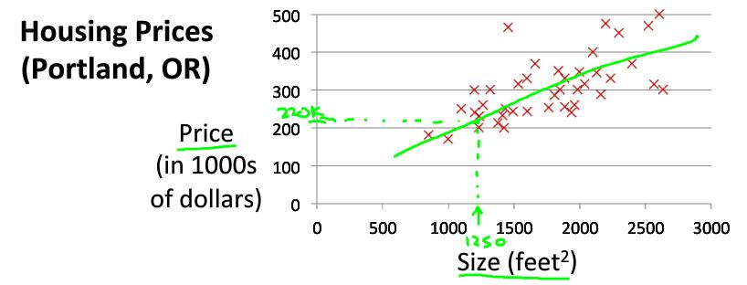
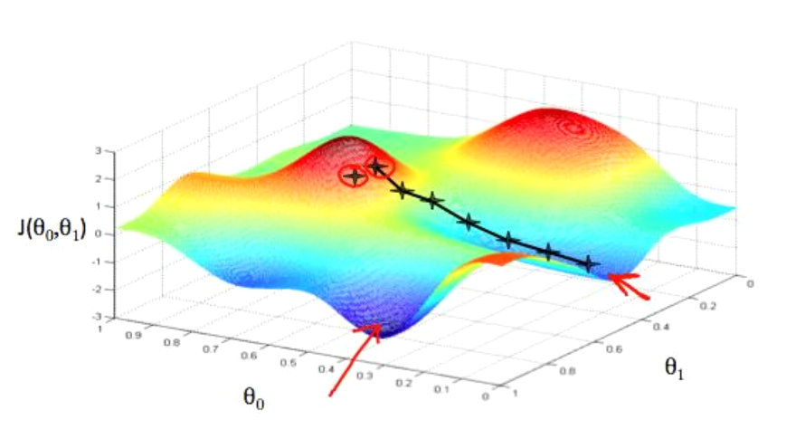
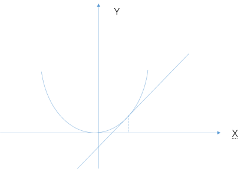
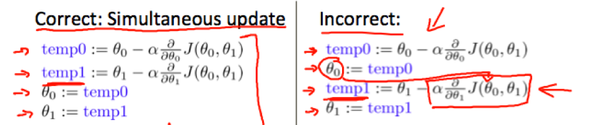
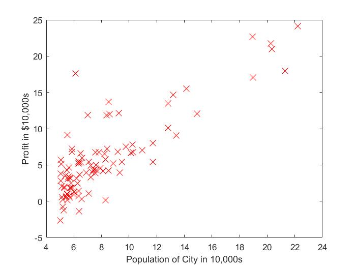
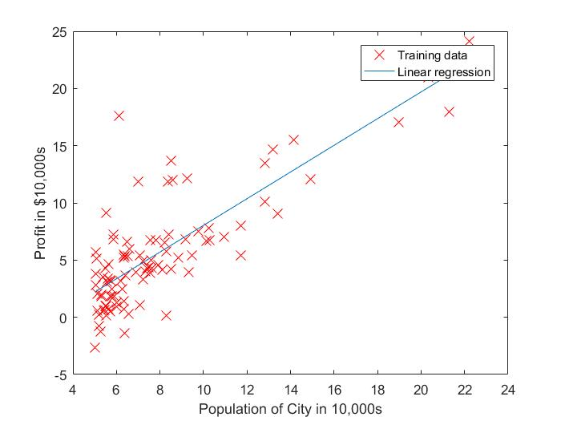
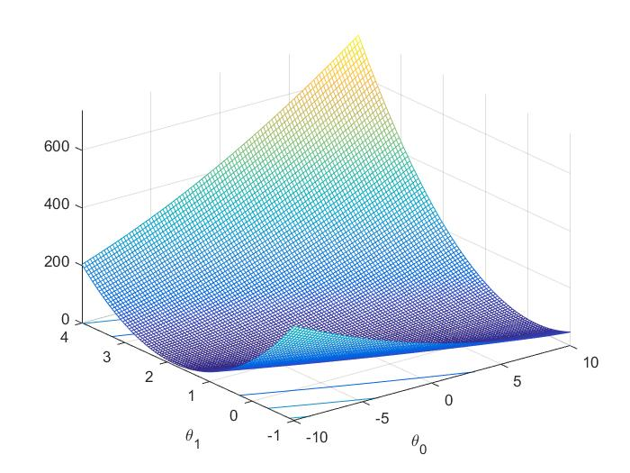
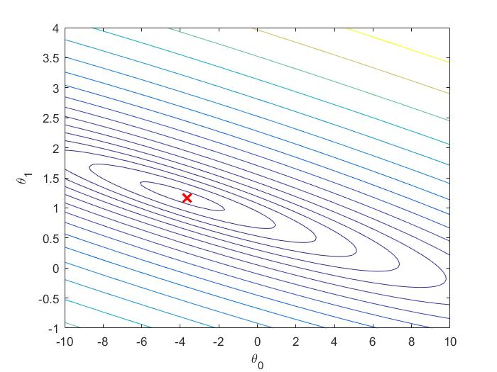

# 二、单变量线性回归

​	回归问题（regression）和分类问题（classification）的区别：

​	回归问题的模型预测值是连续的量，分类问题的模型预测值是离散的量。例如对房屋价格的回归分析是预测其价格，这个值是连续的。对猫狗图片进行分类，最终预测结果是离散的。

+ ## 模型描述

　　以房屋价格模型为例，假设房屋面积是房屋价格的唯一影响因素



　　对于这个问题而言，**训练集（Training Set）**：

| Size in feet^2^ (x) | Price ($) in 1000's (y) |
| ------------------- | ----------------------- |
| 2104                | 406                     |
| 1416                | 232                     |
| 1534                | 315                     |
| 852                 | 178                     |
| ...                 | ...                     |


+ ## 代价函数（Cost Function）

　　一元线性回归的假设函数（Hypothesis）：（用以拟合房屋面积与售价的关系）
$$
h_\theta(x) = \theta_0 + \theta_1x
$$
　　我们可以用代价函数来衡量假设函数的准确性
$$
J(\theta_0,\theta_1) =  \frac{1}{2m}\sum_{i=1}^{m}(h_\theta(x^{(i)})-y^{(i)})^2
$$
　　其中，m表示样本量，x^（i）^、y^（i）^表示第 i 个样本的房屋面积和售价，整体除以 2 是为了求导方便

于是转化为求解最优化问题：
$$
\mathop {min}\limits_{\theta_0,\theta_1} J(\theta_0,\theta_1)
$$


+ ## 梯度下降（Gradient Descent）

　　用迭代方法解决（3）式的优化问题即是梯度下降法，假设我们绘制出不同的 $\theta_0$ 和 $\theta_1$ 下得到的 $J(\theta_0,\theta_1)$ 的图像如下图所示。（当然，也可以使用代数方法直接获得 $\theta_0$ 和 $\theta_1$ 的解析解，但是当假设函数不再是多项式时，其解析解可能无法得到，后面多变量线性回归时将讨论使用法方程求解，但也将面临法方程不可逆的困境）



　　选择一个初始的 $\theta_0​$ 和 $\theta_1​$ ，计算该点的梯度，根据梯度下降的方向更新 $\theta​$，更新公式参照式（4）
$$
\theta_i = \theta_i - \alpha\frac{\partial}{\partial\theta_i}J(\theta_0,\theta_1)
$$
　　对于（4）式为什么更新的 $\theta$ 能使得代价函数值降低的解释。考虑一维情况，当代价函数只有一个变量时，假设 $J(\theta) = \theta^2$ 对于任意一点的  $\theta$  求解的代价函数的导数值代表的是该点的切线方向，数值的大小反映了该点的斜率大小，数值的符号反映了函数值==**增长**==的方向（如图中所示点的导数值为正）。因此对导数值加上一个负号即为函数值减小的方向。（4）中的 $\alpha$ 表示每次移动步长的系数，梯度值越大，移动步长越大。



 

注意：实际计算中需要考虑**同时更新**所有的 $\theta$ 值，如下所示：




+ ## 单变量线性回归实例

　　程序：machine-learning-ex1/ex1/ex1.m 

​	文档：machine-learning-ex1/ex1.pdf

　　假设你是一家连锁餐厅的首席执行官，正在考虑在不同的城市开设一家新餐厅。需要预测的值为利润，参考特征为城市的人口数。

数据样本分布情况：



假设函数：
$$
h_\theta(x) = \theta^Tx = \theta_0 + \theta_1x_1
$$
cost function:
$$
J(\theta) =  \frac{1}{2m}\sum_{i=1}^{m}(h_\theta(x^{(i)})-y^{(i)})^2
$$
带入假设函数：
$$
J(\theta) = \frac{1}{2m}\sum_{i=1}^{m}((\theta_0+\theta_1x^{(i)})-y^{(i)})^2
$$
对  $\theta_0​$  求导：
$$
\frac{\partial J(\theta)}{\theta_0} = \frac{1}{m}\sum_{i=1}^{m}((\theta_0+\theta_1x^{(i)})-y^{(i)})
$$
对  $\theta_1$ 求导：
$$
\frac{\partial J(\theta)}{\theta_1} = \frac{1}{m}\sum_{i=1}^{m}((\theta_0+\theta_1x^{(i)})-y^{(i)})x^{(i)}
$$
于是， $\theta​$ 的更新公式：
$$
\theta_i = \theta_i - \alpha\frac{\partial}{\partial\theta_i}J(\theta_0,\theta_1)
$$


**注意，每一步更新都使用了全部的样本数据，有点类似于神经网络中每一个batch计算一次梯度下降，但不同的是，在线性回归中这样做是由cost function的定义决定的，而神经网络中这样做则是为了防止过拟合现象。**停机准则设定为某一固定的迭代次数。这也意味着，每一次迭代都使用了一次全部的样本数据。

拟合结果：



代价函数可视化：



代价函数的等高线图



关键部分代码：

计算cost function：

```matlab
function J = computeCost(X, y, theta)
%COMPUTECOST Compute cost for linear regression
%   J = COMPUTECOST(X, y, theta) computes the cost of using theta as the
%   parameter for linear regression to fit the data points in X and y

% Initialize some useful values
m = length(y); % number of training examples

% You need to return the following variables correctly 
J = 0;

% ====================== YOUR CODE HERE ======================
% Instructions: Compute the cost of a particular choice of theta
%               You should set J to the cost.
J = 1/(2*m)*sum((sum(X*theta, 2)-y).^2);
% =========================================================================

end

```


梯度下降：（注意同时更新所有 $\theta​$ ）

注意，由于MATLAB中数组下标从1开始，此处 theta(1) 指代 $\theta_0$ ，实际计算中由于 $\theta_0​$ 系数恒为1，因此为自变量 x 增加一维 1 ，类似于

| x1(补充为全1) | x2（原自变量） |
| ------------- | -------------- |
| 1             | 34             |
| 1             | 89             |
| 1             | 77             |
| ...           | ...            |

因此第19行为统一 $\theta$ 的更新公式点乘 x 的第一列其实可以省略 

```matlab
function [theta, J_history] = gradientDescent(X, y, theta, alpha, num_iters)
%GRADIENTDESCENT Performs gradient descent to learn theta
%   theta = GRADIENTDESCENT(X, y, theta, alpha, num_iters) updates theta by 
%   taking num_iters gradient steps with learning rate alpha

% Initialize some useful values
m = length(y); % number of training examples
J_history = zeros(num_iters, 1);

for iter = 1:num_iters

    % ====================== YOUR CODE HERE ======================
    % Instructions: Perform a single gradient step on the parameter vector
    %               theta. 
    %
    % Hint: While debugging, it can be useful to print out the values
    %       of the cost function (computeCost) and gradient here.
    %
    derta1 = alpha.*(1/m*sum((X*theta-y).*X(:,1)));
    derta2 = alpha.*(1/m*sum((X*theta-y).*X(:,2)));
    theta(1) = theta(1) - derta1;
    theta(2) = theta(2) - derta2;
    
    % ============================================================

    % Save the cost J in every iteration    
    J_history(iter) = computeCost(X, y, theta);

end

end

```

