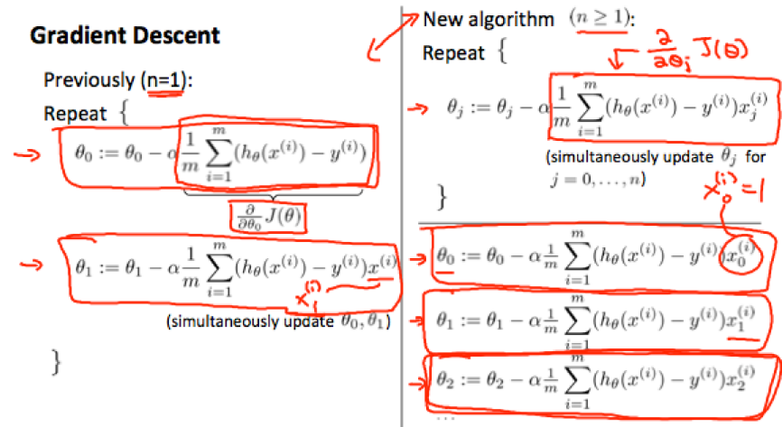
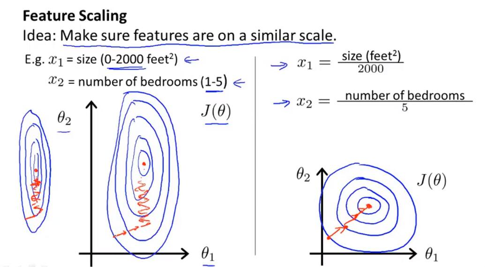
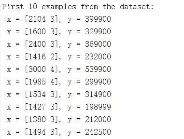
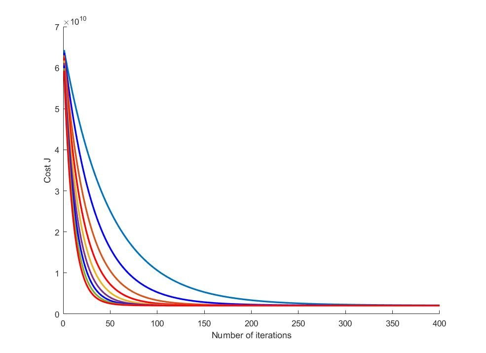

# 多变量线性回归

​	在房屋价格预测问题中，当影响房屋售价的因素不止一个时，需要考虑使用多变量回归解决问题。规定：

​	 $x_j^{(i)}​$ 表示第 i 个样本的第 j 个特征值，m表示样本数目，n表示特征维度

​	此时的线性回归假设模型：
$$
h_\theta(x) = \theta_0 + \theta_1x_1 + \theta_2x_2 + \theta_3x3 + ... + \theta_nx_n
$$
​	可写成矩阵乘法的形式：
$$
h_\theta(x) = [\theta_0\ \theta_1\ ...\ \theta_n] \left[
 \begin{matrix}
 x_0\\ x_1\\ \vdots\\x_n
  \end{matrix}
  \right]=\theta^Tx
$$

​	注意，为了表示方便，在实际计算时， $x_0^{(i)}=1\ for (i\in 1,2,\dots,m)​$ 


+ ## 多变量的梯度下降

　　多变量线性回归的假设模型相比单变量的线性回归并没有本质的区别，对于各个模型参数 $\theta​$ 而言，它们的更新方程是一致的。

repeat until convergence: {
$$
\theta_0 = \theta_0 - \alpha\frac{1}{m}\sum_{i=1}^{m}(h_\theta(x^{(i)}-y^{(i)}))\cdot x_0^{(i)} \\
\theta_1 = \theta_1 - \alpha\frac{1}{m}\sum_{i=1}^{m}(h_\theta(x^{(i)}-y^{(i)}))\cdot x_1^{(i)} \\
\theta_2 = \theta_2 - \alpha\frac{1}{m}\sum_{i=1}^{m}(h_\theta(x^{(i)}-y^{(i)}))\cdot x_2^{(i)} \\
\dots
$$
}

换言之，
$$
\theta_j = \theta_j - \alpha\frac{1}{m}\sum_{i=1}^{m}(h_\theta(x^{(i)}-y^{(i)}))\cdot x_j^{(i)} \qquad for\ j:=0\dots n
$$
**注意**，每一项 $\theta$ 在求和符号内，都需要乘上对应的一项 $x_j^{(i)}$




+ ## 特征缩放（feature scaling）

　　在进行多变量的线性回归实践之前，还有一个需要考虑的问题是特征缩放的问题。假设，如果某一特征的取值范围在 [-1, 1] 之间，而另一项特征的取值范围在 [-1000, 10000]之间，那么可能导致cost function的形态如下图左边所示，这将导致在梯度下降过程中产生 震荡。右图所示的是进行了特征归一化处理的cost function，可以看出这样的处理可以使得梯度下降法更加稳定。



​	**特征缩放的方法**
$$
x_i = \frac{x_i-u_i}{s_i}
$$
​	（5）式中， $u_i$ 表示第 i 个特征的平均值， $s_i$ 表示该特征的范围（最大值与最小值之差），$s_i$ 也可以是该特征值的标准差。例如，如果 $x_i$ 表示房屋的价格，并且在100到2000之间，均值为1000，那么特征缩放后的每一个 $x_i$ 应为 $x_i=\frac{price-1000}{19000}$ 


+ ## 多项式回归

　　此前所讨论的都是线性回归的内容，假设模型中不包含高次项，这样的模型有局限性，在某些场景可能表现不佳。因此我们可以对这些多个特征进行组合，例如对于一个双变量的问题，将 $x_1​$ 和 $x_2​$ 组合成一个新的特征 $x_3​$ ，使得 $x_3 = x_1 \cdot x_2​$ ,再对这三个特征应用线性回归就实现了多项式回归。以下为一些假设模型的举例：
$$
h_\theta(x) = \theta_0+\theta_1x_1+\theta_2x_1^2 \\
h_\theta(x) = \theta_0+\theta_1x_1+\theta_2\sqrt{x_1} \\
h_\theta(x) = \theta_0+\theta_1x_1+\theta_2x_1^2 +\theta_3x_1^3 \\
$$
​	在实践例子中会有举例，**注意假设的多项式模型应当是完备的**（即如果想要拟合的最高次幂为2次，特征维度为2时，模型应该是惟一的：$h_\theta=\theta_0+\theta_1x_1+\theta_2x_2+\theta_3x_1^2+\theta_4x_2^2+\theta_5x_1x_2$）

此时，由于产生了多个特征项，特征缩放工作显得更加重要。

eg. if  $x_1$ has range 1 - 1000 then range of $x_1^2$ becomes 1 - 1000000 and that of $x_1^3​$ becomes 1 - 1000000000

 

+ ## 解决回归问题的直接法：正规方程法（法方程）

​	利用正规方程法可以得到回归方程的的准确解，而不需要进行迭代运算。

​	以下将推导正规方程法：曲线拟合问题的一般提法

​	给定数据 $(x_i,y_i),(i=0,1,2,\dots,m)​$ ，函数空间 $\Phi=span\{\phi_0(x),\phi_1(x),\dots\phi_n(x)\} = \{\phi(x)=a_0\phi_0(x)+a_1\phi_1(x)+\dots+a_n\phi_n(x) \}​$ 

$a_i\in R, i=0,1\dots,n​$

​	其中 $\phi_0(x),\phi_1(x),\dots,\phi_n(x)​$ 线性无关。$\phi(x)​$ 在 $x_i​$ 处的残差 $\delta_i=\phi(x_i)-y_i​$ 选取 $\phi(x)\in \Phi​$ 使得总体残差在某种度量准则下最小。

1. 残差最大绝对值 $\max_\limits{0\le i \le m}  |\delta_i|​$  达到最小
2. 残差绝对值之和 $\sum_\limits{i=0}^{m}|\delta_i|$ 达到最小
3. 残差平方和 $\sum_\limits{i=0}^{m} \delta_i^2$ 达到最小 （最小二乘）

$$
Min \ Q(a_0,a_1,\dots,a_n)=\sum_{i=0}^{m}\delta^2_i \\
Q(a_0,a_1,\dots,a_n)=\sum_{i=0}^{m}\delta^2_i \\
=\sum_{i=0}^{m}[y_i-(a_0\phi_0(x)+\dots+a_n\phi_n(x))]^2 \\
=\sum_{i=0}^{m}[y_i-\sum_{j=0}^{n}a_j\phi_j(x)]^2
$$

多元函数极值的性质，极小值点必满足
$$
\frac{\partial Q}{\partial a_k}=0 \ \ \ \ \ k=0,1,\dots,n \\
\sum_{i=0}^m[2(\sum_{j=0}^{n}a_j\phi_j(x_i)-y_i)\phi_k(x_i)]=0 \\
\sum_{i=0}^m[\sum_{j=0}^n[a_j\phi_j(x_i)\phi_k(x_i)]-y_i\phi_k(x_i)]=0\\
\sum_{i=0}^m\sum_{j=0}^n[a_j\phi_j(x_i)\phi_k(x_i)]-\sum_{i=0}^my_i\phi_k(x_i)=0
$$
令 $(\phi_j,\phi_k)=\sum_\limits{i=0}^{m}\phi_j(x_i)\phi_k(x_i), \  (\phi_k,f)=\sum_\limits{i=0}^my_i\phi_k(x_i)​$  

则
$$
\sum_{j=0}^{n}a_j(\phi_j,\phi_k)=(\phi_k,f) \quad k=0,1,\dots,n\\
$$
对每个 $a_k​$ 求导数并令为 0 ： 
$$
\left ( \begin{matrix}
 (\phi_0,\phi_0) & \dots & (\phi_0,\phi_n) \\
 \vdots & \ddots & \vdots \\
 (\phi_n,\phi_0) & \dots & (\phi_n,\phi_n)
\end{matrix}
\right )
\left(\begin{matrix}
a_0\\\vdots\\a_n
\end{matrix}
\right)
=
\left(\begin{matrix}
(\phi_0,f)\\\vdots\\(\phi_n,f)
\end{matrix}
\right)\qquad 法方程 \\
离散Gram矩阵 \qquad\qquad\qquad\qquad\qquad\qquad\qquad
$$
由于  $\phi_0(x),\phi_1(x),\dots,\phi_n(x)$ 线性无关，该方程组存在唯一解 $a_0^*a_1^*,\dots,a_n^*$ 

**拟合函数为**：
$$
\phi^*(x) = a_0^*\phi_0(x)+a_1^*\phi_1(x)+\dots+a_n^*\phi_n(x)
$$
相应的残差平方和为：
$$
||\delta||_2^2 = \sum_{k=0}^{m}[y_k-\sum_{i=0}^{n}a_i^*\phi_i(x_k)]^2
$$


**多项式拟合**：
$$
\phi_j = x^j,(j=0,1,\dots,n) \\
\phi(x) = a_0+a_1x+\dots+a_nx^n
$$
相应的法方程为：
$$
\left[\begin{matrix}
\sum_{i=0}^{m}1 & \sum_{i=0}^{m}x_i & \dots & \sum_{i=0}^{m}x_i^n \\
\sum_{i=0}^{m}x_i & \sum_{i=0}^{m}x_i^2 & \dots & \sum_{i=0}^{m}x_i^{n+1} \\\vdots&\vdots&\ddots&\vdots\\
\sum_{i=0}^{m}x_i^{n} & \sum_{i=0}^{m}x_i^{n+1} & \dots & \sum_{i=0}^{m}x_i^{2n}
\end{matrix}\right]
\left[\begin{matrix}
a_0\\a_1\\\vdots\\a_n
\end{matrix}\right]
=
\left[\begin{matrix}
\sum_{i=0}^{m}y_i\\\sum_{i=0}^{m}y_ix_i\\\vdots\\\sum_{i=0}^{m}y_ix_i^n
\end{matrix}\right]
$$


**线性最小二乘**

* 设 $y = a+bx​$ 则

$$
\begin{equation} \label{eq}
\left\{ \begin{aligned}
a+bx_0=y_0\\
a+bx_1=y_1\\
...\quad\quad\quad\\
a+bx_n=y_n\\
\end{aligned}
\right.
\end{equation}
\Leftrightarrow
\left[\begin{matrix}
1 & x_0\\
1 & x_1\\
\vdots & \vdots\\
1 & x_m
\end{matrix}\right]
\left[\begin{matrix}
a\\b
\end{matrix}\right]
=
\left[\begin{matrix}
y_0\\
y_1\\
\vdots\\
y_n
\end{matrix}\right]
\Leftrightarrow
A\alpha=\beta
$$

+ 最小二乘：（15）式是一个超定方程组，无解，为使得（15）有解，在等式左右两边同时乘上一个矩阵 A 的转置：

$$
A^TA\alpha=A^T\beta
\Leftrightarrow
\left[\begin{matrix}
m+1&\sum x_i\\
\sum x_i & \sum x_i^2
\end{matrix}\right]
\left[\begin{matrix}
a\\b
\end{matrix}\right]
=
\left[\begin{matrix}
\sum y_i\\\sum y_ix_i
\end{matrix}\right]
$$

* 对于非线性拟合 $y = a+b\sin(x)+c\cos(x)$ ，可以采用同样的思路。

$$
\begin{equation} \label{eq2}
\left\{ \begin{aligned}
a+b\sin(x_0)+c\cos(x_0)=y_0\\
a+b\sin(x_1)+c\cos(x_1)=y_1\\
...\quad\quad\quad\quad\quad\quad\quad\quad\quad\\
a+b\sin(x_m)+c\cos(x_m)=y_m\\
\end{aligned}
\right.
\end{equation}
\Leftrightarrow
\left[\begin{matrix}
1 & \sin(x_0)&\cos(x_0)\\
1 & \sin(x_1)&\cos(x_1)\\
\vdots & \vdots\\
1 & \sin(x_m)&\cos(x_m)
\end{matrix}\right]
\left[\begin{matrix}
a\\b\\c
\end{matrix}\right]
=
\left[\begin{matrix}
y_0\\
y_1\\
\vdots\\
y_n
\end{matrix}\right]
\Leftrightarrow
A\alpha=\beta
$$


**超定方程组的最小二乘解**

​	事实上，**曲线拟合最小二乘问题等价于超定方程组**，考虑超定方程组 $A_{m\times n}x_n=b_m$ 其中 $m\ge n$ . 记 $r=Ax-b​$ ，则最小二乘解为：
$$
Min ||r||_2^2 = Min ||Ax-b||_2^2
$$
**定理：**向量 $X^*$ 为 $Ax=b$ 的最小二乘解 $\Leftrightarrow$ $A^TAX^*=A^Tb$  （若A各列线性无关，则解存在唯一）

证明待补充。


* ## 多变量线性回归实例

  程序：machine-learning-ex1/ex1/ex1_multi.m

  文档：machine-learning-ex1/ex1.pdf

  多变量线性回归实例中处理的数据包括了两个维度的特征：



* 处理多变量问题首先应该使得各特征值尺度归一化

```matlab
function [X_norm, mu, sigma] = featureNormalize(X)
%FEATURENORMALIZE Normalizes the features in X 
%   FEATURENORMALIZE(X) returns a normalized version of X where
%   the mean value of each feature is 0 and the standard deviation
%   is 1. This is often a good preprocessing step to do when
%   working with learning algorithms.

% You need to set these values correctly
X_norm = X;
mu = zeros(1, size(X, 2));
sigma = zeros(1, size(X, 2));

% ====================== YOUR CODE HERE ======================
% Instructions: First, for each feature dimension, compute the mean
%               of the feature and subtract it from the dataset,
%               storing the mean value in mu. Next, compute the 
%               standard deviation of each feature and divide
%               each feature by it's standard deviation, storing
%               the standard deviation in sigma. 
%
%               Note that X is a matrix where each column is a 
%               feature and each row is an example. You need 
%               to perform the normalization separately for 
%               each feature. 
%
% Hint: You might find the 'mean' and 'std' functions useful.
%
mu = mean(X, 1);
sigma = std(X,0,1);
X_norm = (X - mu)./sigma;
% ============================================================

end
```


* 梯度下降法

  由于每一个特征对应一个参数 $\theta$ ，20行计算每一个 $\theta$  的梯度值，23 行同步更新

```matlab
function [theta, J_history] = gradientDescentMulti(X, y, theta, alpha, num_iters)
%GRADIENTDESCENTMULTI Performs gradient descent to learn theta
%   theta = GRADIENTDESCENTMULTI(x, y, theta, alpha, num_iters) updates theta by
%   taking num_iters gradient steps with learning rate alpha

% Initialize some useful values
m = length(y); % number of training examples
J_history = zeros(num_iters, 1);

for iter = 1:num_iters

    % ====================== YOUR CODE HERE ======================
    % Instructions: Perform a single gradient step on the parameter vector
    %               theta. 
    %
    % Hint: While debugging, it can be useful to print out the values
    %       of the cost function (computeCostMulti) and gradient here.
    %
    derta = zeros(size(theta));
    for i = 1:size(X, 2)
         derta(i, 1) = alpha.*(mean((X*theta-y).*X(:,i)));
    end
    theta = theta - derta;
    % ============================================================

    % Save the cost J in every iteration    
    J_history(iter) = computeCostMulti(X, y, theta);

end
end
```

​	下图显示了不同 $\alpha$ 时 cost function 的下降情况



* 正规方程法

  使用正规方程求解  $\theta​$  时，假设模型 $A\theta=y​$ ，由定理，其最小二乘解为 $A^TA\theta=A^Ty​$ ，则

$$
\theta= (A^TA)^{-1}Ay
$$

```matlab
function [theta] = normalEqn(X, y)
%NORMALEQN Computes the closed-form solution to linear regression 
%   NORMALEQN(X,y) computes the closed-form solution to linear 
%   regression using the normal equations.
theta = zeros(size(X, 2), 1);
% ====================== YOUR CODE HERE ======================
% Instructions: Complete the code to compute the closed form solution
%               to linear regression and put the result in theta.
%

% ---------------------- Sample Solution ----------------------
theta = (X'*X)^(-1)*X'*y;

% -------------------------------------------------------------

% ============================================================

end

```

​	注意，当 $A^TA$ 的逆不存在时，matlab 中可使用 pinv（ $A^TA$ ）求解其近似的逆

​	

#### 最后，关于多项式回归的内容将在后面章节 正则化中实现

