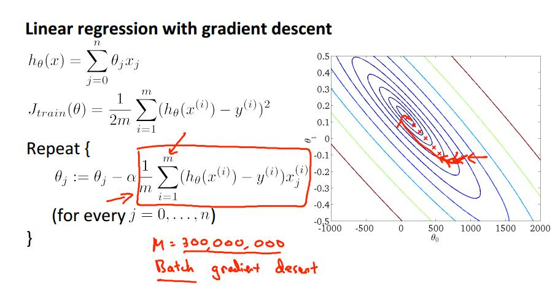
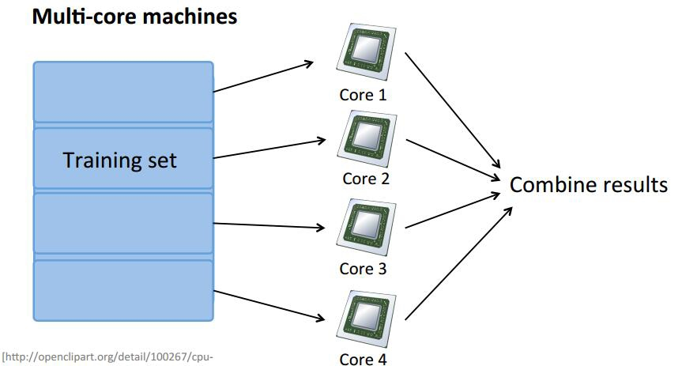

# 大规模机器学习和照片OCR

​		大规模机器学习是指一个机器学习的任务中样本数量庞大，应用此前的机器学习方法和算法所需要的时间和计算资源都不够的情形。本节将给出应对此类大型复杂问题的一般解决思路和建议，包括随机梯度下降、mini-batch的梯度下降、和并行处理等相关方法。

## 随机梯度下降（Stochastic gradient descent）

​		以线性回归为例，此前介绍的主要思路是，首先确定算法的优化目标即 Cost Function， 其次利用梯度下降法求解最优值点。
$$
h_\theta(x)=\sum_{j=0}^n\theta_jx_j\\
J_{train}(x) = \frac{1}{2m}\sum_{i=1}^m(h_\theta(x^{(i)})-y^{(i)})^2\\
Repeat\{ \qquad\qquad\qquad\qquad\qquad\quad\quad\quad\quad\quad\quad\quad\quad\quad\\
 \theta_j:=\theta_j-\alpha\frac{1}{m}\sum_{i=1}^m(h_{\theta}(x^{(i)})-y^{(i)})x_j^{(i)}\\
 (for\ every\ j=0,...,n)\\
\}\qquad\qquad\qquad\qquad\qquad\qquad\qquad\qquad\qquad\qquad\quad
$$

​		如图中所示的，梯度下降法计算一次梯度，需要计算在所有样本上的梯度和，当样本数目特别大的时候，比如达到3亿时，每计算一次梯度时间是无法接受的。但梯度下降法本身的好处在于其找到最优点的路径一般是稳定的，不会有较大的波动。为了解决大规模样本的计算复杂度太高的问题，可以使用随机梯度下降法（Stochastic gradient descent）。

​		首先重新定义 Cost Function ，现在Cost Function仅是在一个样本上的值：
$$
cost(\theta,(x^{(i)},y^{(i)}))=\frac{1}{2}(h_\theta(x^{(i)})-y^{(i)})^2\\
J_{train}(\theta)=\frac{1}{m}\sum_{i=1}^mcost(\theta,(x^{(i)},y^{(i)}))\\
$$
​		随机打乱样本集合，并循环样本集，每一个样本进行一次梯度下降：
$$
Repeat\{\\ \qquad\qquad
\theta_j:=\theta_j-\alpha(h_\theta(x^{(i)})-y^{(i)})x_j^{(i)}\\
for(j=0,\dots,n)\\
\}\qquad\qquad\qquad\qquad\qquad\qquad\qquad\qquad\qquad
$$
​		对于随机梯度下降而言，再大的数据样本量都不是问题，但问题在于有可能不同的样本所计算的梯度会相互抵消，对于错误样本的容忍程度变低了，并且算法收敛性存在着一定的问题，可能会在最优点附近震荡。为了解决这个缺点，引入了基于 Mini-batch 的梯度下降方法。

## Mini-batch 梯度下降法

​		Batch gradient descent：使用所有的 m 个样本计算一次梯度值

​		Stochastic gradient descent：使用 1 个样本计算一次梯度值

​		Mini-batch gradient descent：使用 b 个样本计算一次梯度值

​		可以看出，Mini-batch 梯度下降法是批梯度下降和随机梯度下降的一种折中方法。
$$
b = 10,\ m=1000.\\
Repeat\{\qquad\qquad\\
\qquad for\ i=1,11,21,31,\dots,991\{\\
\qquad\qquad
\theta_j:=\theta_j-\alpha\frac{1}{10}\sum_{k=i}^{i+9}(h_\theta(x^{(k)})-y^{(k)})x_j^{(k)}\\
(for\ every\ j=0,\dots,n) \\
\}\qquad\qquad\qquad\qquad\qquad\qquad\qquad\qquad\\
\}\qquad\qquad\qquad\qquad\qquad\qquad\qquad\qquad\qquad\qquad
$$

## 并行计算方法

​		在使用批梯度下降方法的时候，解决样本数量过大的另一个方法是使用并行计算。假如你有多台计算机或者你的计算机有多个核，都可以按以下思路计算一次迭代的梯度：

​		

​		由于批梯度下降法每一次都要计算所有样本的和，因此，可以将样本集合分为几个 set 分配给不同的核或者计算机并行计算每个 set 的和值，最后在一台主机上汇总结果，完成一次迭代。

## 照片OCR

​		OCR（Optical Character Recognition，光学字符识别），由于这一部分主要是介绍性质的学习内容，课程本身没有提供练习实例，此处不在赘述，详细内容可参考课程课件。