# 应用机器学习的建议

​		当我们完成了对一个问题的模型构建后，如果目前的模型对数据分类的表现不佳时如何修改模型？一般而言有以下几种方法：

* 加入更多训练数据
* 尝试更少的特征
* 尝试增加特征维度
* 试着使用多项式拟合
* 增加或者减小 $\lambda$ 

那么什么情况下该选择什么样的方法呢，这需要我们能够对已有模型进行评估。

>A hypothesis may have a low error for the training examples but still be inaccurate (because of overfitting). Thus, to evaluate a hypothesis, given a dataset of training examples, we can split up the data into two sets: a training set and a test set. Typically, the training set consists of 70 % of your data and the test set is the remaining 30 % 

## 模型评价		

​		一个模型可能因为过拟合在训练数据上有较小的误差，但在真正的应用中未必有好的表现，因此，**为了检测过拟合现象是否出现，引入了测试集**， 一般情况下测试集与训练集比例约为 7 ： 3 。训练集和测试集的使用方法：

1. 利用训练集最小化代价函数（误差函数 loss） $J_{train}(\theta)$ ，求出模型参数 $\theta$ 
2. 在测试集上计算误差 $J_{test}(\theta)$ 

​		测试集上的误差计算公式：

1. 对于回归问题： $J_{test}(\theta)=\frac{1}{2m_{test}}\sum_{i=1}^{m_{test}}(h_{\theta}(x_{test}^{(i)})-y_{test}^{(i)})^2$ 
2. 对于分类问题（0-1分类问题为例）： 

$$
err(h_{\theta}(x),y)=
\left\{\begin{aligned}
& 1 \qquad  if \quad h_\theta \ge 0.5 \quad and \quad y=1 \quad or \quad h_\theta \le 0.5 \quad and \quad y=1\\
& 0 \quad \quad otherwise
\end{aligned}
\right.
$$

​		在测试集上的平均误差：
$$
Test Error = \frac{1}{m_{test}}\sum_{i=1}^{m_{test}}err(h_{\theta}(x_{test}^{(i)}),y_{test}^{(i)})
$$
​		系统在测试集上的表现即可作为评价系统好坏的标准。

## 验证集的引入

​		将样本集合分为训练集合和测试集合解决了对模型性能的评估问题。现在，如果有许多不同次数的多项式模型，它们对训练集的拟合程度都很好，如何选择最好的一个呢？因为可能对训练集拟合的太好而出现过拟合现象，在真实数据集中表现不佳。自然想到将这些模型用模型评价的方法测试它们在测试集上的表现，选择在测试集合上误差最小的一个模型。但是，在这个时候，我们相当于用测试集去学习了模型参数“多项式的最高次数”，如果我们再将这个测试集合上的误差作为在实际数据上的表现显然是行不通的（因为它已经被使用过了）。为此，如果我们还想对该模型在实际数据的表现进行评估就应当引入验证集。

​		首先对样本进行随机划分：

* 训练集 60%
* 验证集 20%
* 测试集 20%

​		对模型的优化流程变为：

1. 利用训练集最小化代价函数（误差函数 loss） $J_{train}(\theta, d)$ ，求出不同 d（d 是 $\theta$ 最大次数） 时最优的模型参数 $\theta$ 

2. 计算这些模型在验证集下的误差
3. 选择验证集误差最小的模型，计算其在测试集上的表现

## 区别欠拟合（Bias）和过拟合（Variance）

​		过拟合和欠拟合的概念已经在正则化一章内详细讨论，此处不再赘述，下图说明：

​		首先观察 d 和训练集、验证集误差的关系图，随着拟合次数越来越高，对于训练样本的拟合会越来越好，误差也越来越小。对于验证集而言，前期由于模型太简单不能很好的表现，误差较大，随着次数增加表现越来越好，但次数太高以后出现过了对训练数据的拟合现象，反而在验证集的表现不好。因此，当模型在训练集误差小，测试集误差大时即出现了过拟合，二者的误差都大时则出现了欠拟合。

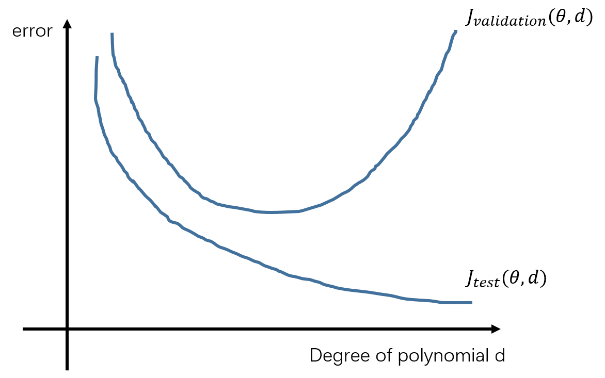

## 正则化

​		首先要理解的是正则化系数在模型表现中的作用，从此前正则化一章的笔记中可以看出，**参数越小**对高次项的**限制越小**， 此时越容易出现**过拟合现**象，**参数越大**时对高次项的**限制越大**，容易出现**欠拟合**现象。

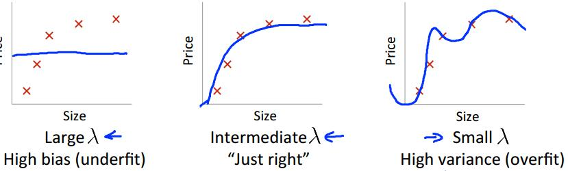

​		因此，对照上文的分析方式，可以得到正则化系数 $\lambda$ 和训练集、验证集的关系为：

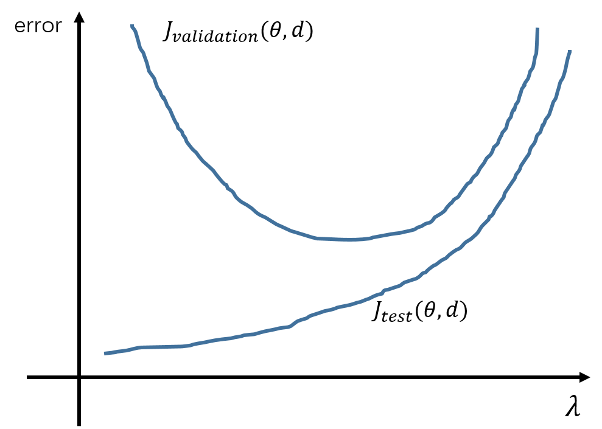

## 学习曲线

​		大部分情况下，当我们的模型表现不佳时，第一时间想到的方法是增加训练数据，但这个办法不是一直有效，绘制学习曲线可以帮助我们了解什么时候增加训练数据量是有意义的。所谓的学习曲线是指以训练数据的规模（样本量）为自变量，在由小及大的训练数据中训练模型参数，计算其在训练集和验证集下的误差。可以看到当训练集较小时误差数据较少，模型可以兼顾少量的数据样本，但在验证集中表现不好。但随着对训练样本增加，模型越来越难以兼顾所有的训练样本，因此训练集误差增加，但因为模型从更多训练样本中学到了特征，验证集误差减少。

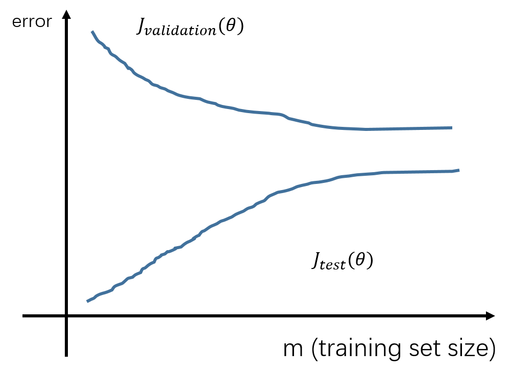

​		在模型出现了**欠拟合**的情况时，学习曲线如下如所示，由于模型欠拟合，在少量的训练数据中表现好，但训练数据越多，实际情况越复杂，在训练集的误差也就越大。当训练误差和验证集误差趋于稳定时，这个误差值是比较大的。

​		当模型**过拟合**时，训练集规模的增加对模型的影响不再像欠拟合时那么明显，模拟可以兼顾更多的训练样本，即使在多样本的复杂情况下也能很好的拟合数据。但由于是过拟合，因此仅仅只是在训练数据上表现良好，在验证集上的误差就会比较大，但随着训练样本增多，模型学到更多的特征，在验证集的表现也会变好。过拟合时学习曲线比较明显的特征是两条线不再像欠拟合时收敛到一起，而是有较大的间距，中间有一条明显的断带。

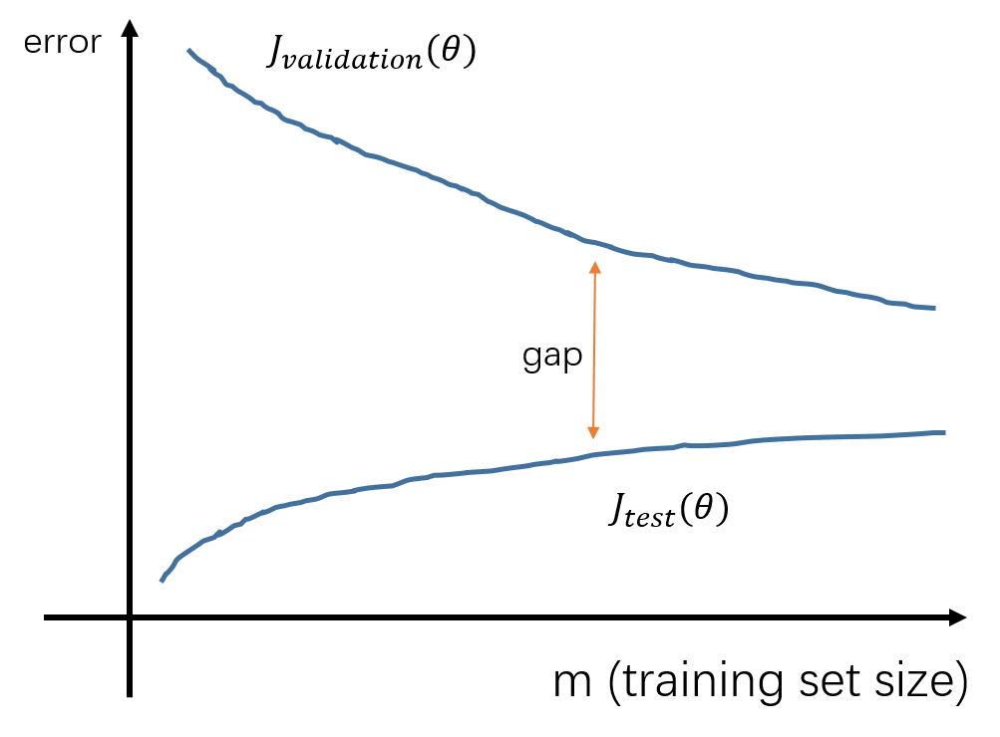

​		回到最开始提出的解决方案，用以应对不同的情况：

- 加入更多训练数据——过拟合
- 尝试更少的特征——过拟合
- 尝试增加特征维度——欠拟合
- 试着使用多项式拟合——欠拟合
- 增加 $\lambda$ ——过拟合
- 减小 $\lambda$ ——欠拟合

## 实例：训练集、验证集和测试集的应用

​		程序：machine-learning-ex5/ex5/ex5.m

​		文档：machine-learning-ex5/ex5.pdf

​		实例中将通过一个线性拟合的例子说明本文总所提的各个曲线图的画法，以及欠拟合和过拟合情况下的各曲线图的形态特征。

* 数据分布

* 对数据进行线性拟合

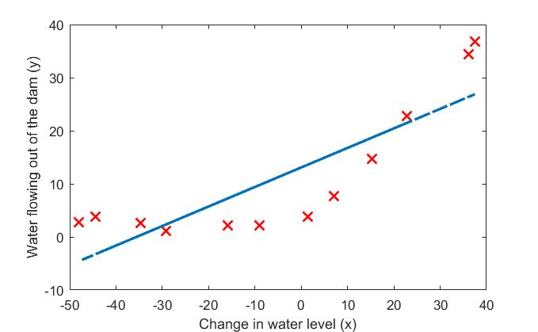

* 线性拟合学习曲线（欠拟合）

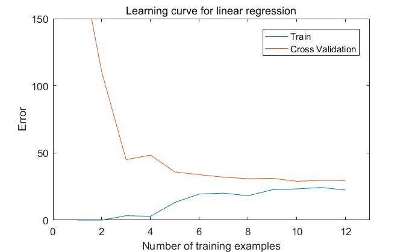

​		两条曲线几乎收敛到一起，并且误差较大。

* 正则化系数为 100 时的多项式拟合（欠拟合）

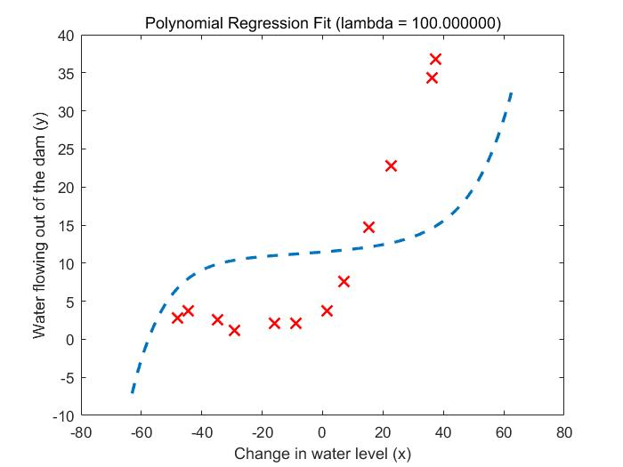

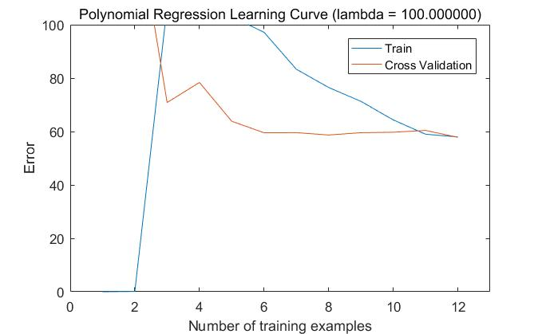

​		特征类似，收敛时都有较大的误差。

* 正则化系数为 3 时的多项式拟合（拟合效果不错）

拟合曲线

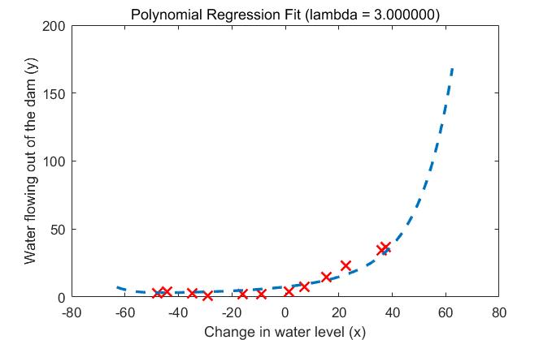

学习曲线

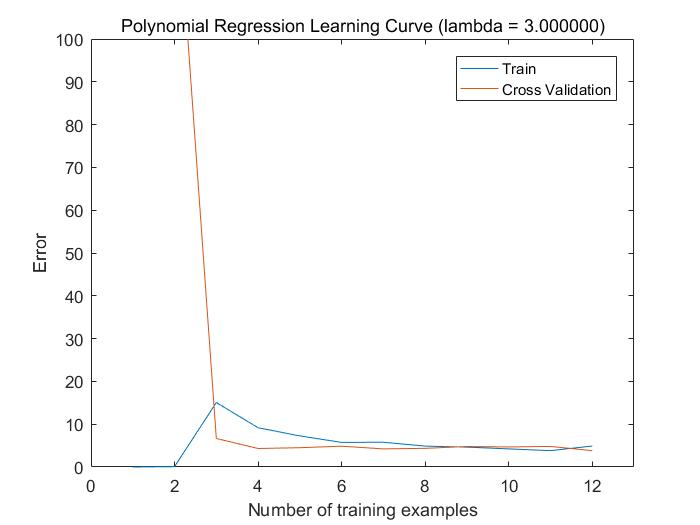

* 正则化系数为 0 的多项式拟合（过拟合）

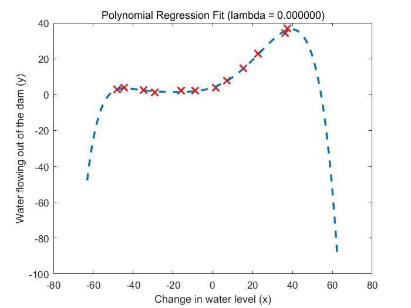

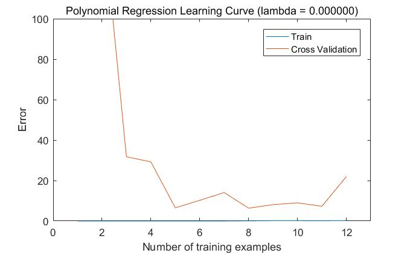

​		可以看到两条学习曲线之间的明显的 gap 。

* 多项式拟合，训练集、验证集关于 $\lambda$ 的曲线（参数越大，对高次项限制加强，欠拟合严重，参数越小过拟合）

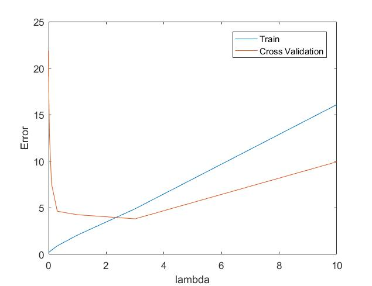