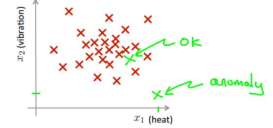
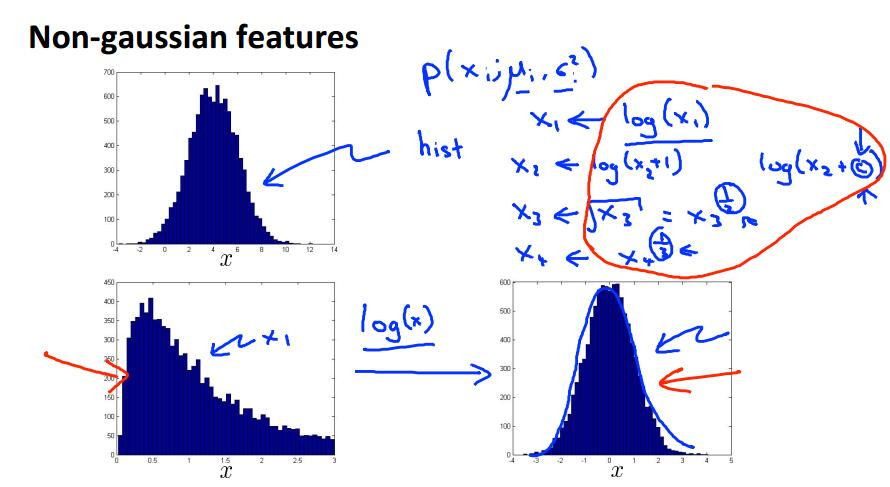
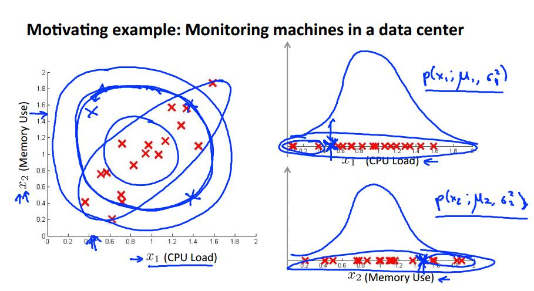
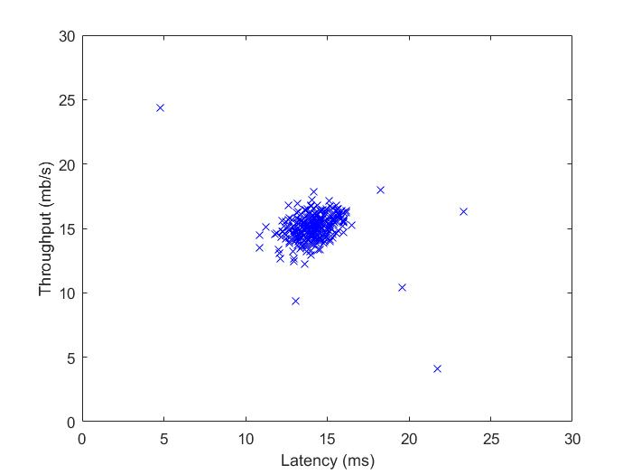
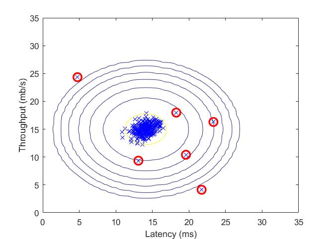

# 异常检测

​		本节的问题背景是，假设有一批航空发动机需要进行质量检测，首先已经将发动机的各项参数抽取出来作为其特征向量，假设仅抽取两项，那么可以在二维平面上绘制出这些样本，如下图所示：



​		据图中可以看出，某些偏离样本集合太远的点有理由怀疑是非正常样本。本节的主要目标就是根据一批样本点估计新加入的，或者其中的异常样本。主要依据的方法是概率统计中对样本分布的参数估计的方法——最大似然估计，我们需要对样本分布做出这样的假设：各个特征相互独立，且近似服从正态分布。（特征之间不独立的，或者不服从正态分布的，可稍作处理，后文会提到）


## 异常检测算法

​		首先，我们假定某样本集合具有 n 特征维度，各个特征维度相互独立，且服从不同参数的正态分布，已知这一批样本全是合格样本，需要建立概率模型用于判断新进的样本是否是合格的。由此模型的形式应当是：
$$
\left.\begin{aligned}
P(X)
=&p(x_1;\mu_1,\sigma^2_1)\sdot p(x_2;\mu_2,\sigma^2_2)\dots p(x_n;\mu_n,\sigma^2_n)\\
=&\Pi_{j=1}^np(x_j;\mu_j,\sigma^2_j)
\end{aligned}\right. \tag{*}
$$
​		其中 X 表示一个样本，$x_j$ 示在第 j 个特征上的取值，$\mu_j,\sigma_j$ 分别是正态分布的参数，由于各个特征维度之间相互独立，整体的分布概率为 P（X）为各个特征维度的分布概率的乘积。 于是问题转化依据一组已知样本求取其各个特征维度上的正态分布的参数。上式也称为样本的似然函数。

​		推导一组 $\mu,\sigma$ 的求解，所有的参数求解具有相似性。

​		设某一个特征维度 x 的取值服从正态分布，即 $x \sim N(\mu,\sigma)$ ，x 的所有样本取值为 $x_1,x_2,\dots x_m$ （m 个样本）。则 X 的概率密度为：
$$
f(x;\mu,\sigma)=\frac{1}{\sqrt{2\pi\sigma}}\exp[-\frac{1}{2\sigma^2}(x-\mu)^2]
$$
​		似然函数为：
$$
\begin{aligned}
&L(\mu,\sigma)
=\Pi_{i=1}^m\frac{1}{\sqrt{2\pi\sigma}}\exp[-\frac{1}{2\sigma^2}(x_i-\mu)^2]\\
&\quad \quad \quad =(2\pi)^{-m/2}(\sigma^2)^{-m/2}\exp[-\frac{1}{2\sigma^2}\sum_{i=1}^m(x_i-\mu)^2]\\
&\ln L = -\frac{m}{2}\ln(2\pi)-\frac{m}{2}\ln\sigma^2-\frac{1}{2\sigma^2}\sum_{i=1}^m(x_i-\mu)^2\\
\\
& 令\\
\\
&\frac{\partial}{\partial \mu}\ln L=\frac{1}{\sigma^2}(\sum_{i=1}^mx_i-m\mu)=0\\
&\frac{\partial}{\partial \sigma}\ln L= -\frac{m}{2\sigma^2}+\frac{1}{2(\sigma^2)^2}\sum_{i=1}^m(x_i-\mu)^2 =0
\end{aligned}
$$
​		最大似然估计法的原理在于，现在已经取到了样本值 $x_1,x_2,\dots x_m$ 了，这表明取到这一组样本的概率值 $L(\theta)$ 比较大，我们也就不会考虑哪些不能使得样本值 $x_1,x_2,\dots x_m$ 出现的参数 $\mu,\sigma$ 。因而考虑寻找能够使得 $x_1,x_2,\dots x_m$ 出现概率最大的参数作为总体分布的估计。根据上式可以得到：
$$
\hat{\mu} = \frac{1}{m}\sum_{i=1}^mx_i=\bar{x}\\
\hat{\sigma}=\frac{1}{m}\sum_{i=1}^m(x_i-\bar{x})^2
$$
​		这说明了在正态分布的参数估计中，总体的均值可由样本均值近似，总体方差可由样本方差近似。注意，在数理统计中讨论无偏估计时有这样的结论：$\hat{\sigma}=\frac{1}{m-1}\sum_{i=1}^m(x_i-\bar{x})^2$ ，即总体方差的无偏估计和（20式稍有不同，实际应用中影响不大，本节中均采用（2）式的形式。

​		针对每一个维度求出其正态分布的参数后，就可带入（*）式得到任何一个样本的综合分布概率模型，设定一个阈值 $\epsilon$ ，带入需要考察的样本，当计算结果小于 $\epsilon$ 时，即认为该样本偏离样本集合太多，判断为异常样本。


## 阈值的选择

​		经过上一步骤我们已经可以得到各个样本维度上特征值的分布概率，并可以依据（*）式计算出一个指标，供判断样本是否异常，关键还需要确定阈值 $\epsilon$ 。现在假设给定样本时带有标记的，其中大部分样本（80%以上）都是正常样本，标记为 0 ， 其余的为异常样本，标记为 1 。我们首先由上面方法建模出了（\*）式，选择 $\epsilon$ 的方式为，利用验证集来确定（训练集用于建模（\*）式）。

​		首先选定一些列的 $\epsilon$ ，在不同的 $\epsilon$ 下对验证集样本进行分类，即
$$
y=
\left\{\begin{matrix}
1\quad\quad if\ P(x)\le \epsilon \ (anomaly)\\
0\quad\quad if\ P(x)\gt\epsilon \ (normal) \ \ 
\end{matrix}
\right.
$$
​		再根据此前章节 “机器学习系统设计” 中提到的方法计算 F1 指数，选择 F1 指数最大的为最优的$\epsilon$ 。


 ## 异常检测 vs 高级学习算法

​		注意到，其实异常检测也是学习算法的一种，只不过异常检测方法是基于概率统计的分类算法，某些能够应用异常检测的场景似乎也可以用此前的学习算法解决，比如神经网络、逻辑回归、支持向量机等等。那么什么时候选择异常检测，什么时候选择这些高级的学习算法呢？

​		从前面的例子中也不难发现，对于**异常检测**而言，针对的是正负样本极不均衡的情况，即某一类别的样本数目特别大，另外一个类比的很少（异常样本）。其次是异常样本出错的原因千奇百怪，但现有的异常样本不足以驱动我们的高级学习算法“学到”异常样本的特征，即可能新的异常样本是训练集中异常样本都没有的情况。对于**高级学习算法**而言，通常需要正负样本的数目均衡，并且任何一个类别都能狗提供足够的信息量供学习模型“学习”。并且样本数目需要达到一定的水平。


## 特征选择

​		当某一特征的值分布不是近似的正态分布时，可对其做一些函数映射使其映射后的分布近似接近正态分布，如下图所示：




## 多变量的高斯分布

​		此前讨论的都是在样本集合的特征相互独立的假设下进行的，某些情况下两个特征之间可能并不是独立的，而是具有某些相关关系，比如一台计算机CPU的占用情况和内存的使用情况之间，通常情况下当CPU占用高时，内存使用也高，CPU闲置时内存空闲也大，如下图所示：



​		这时，虽然CPU负载和内存占用各自都符合正态分布，但它们的联合概率分布不再是二者各自概率相乘的关系，而是符合一个由二者共同确定的概率函数：
$$
p(x)=\frac{1}{(2\pi)^{\frac{m}{2}}|\Sigma|^{\frac{1}{2}}}\exp(-\frac{1}{2}(x-\mu)^T\Sigma^{-1}(x-\mu))
$$
​		其中 $x^{(i)}=\{x_{1},x_{2},\dots,x_{n}\}$ ，表示一个样本， $\Sigma=\frac{1}{m}\sum_{i=1}^m(x^{(i)}-\mu)(x^{(i)}-u)^T$ ，同样的，我们用样本均值代替总体均值：
$$
\mu = \frac{1}{m}\sum_{i=1}^mx^{(i)}
$$
​		于是就完成了对多变量高斯函数的建模，利用 F1 值的最大化选择最佳的阈值后，即完成了异常检测模型的建立。


## 应用实例

​		程序：machine-learning-ex8/ex8/ex8.m

​		文档：machine-learning-ex8/ex8.pdf

​		数据背景为，为了检测计算机集群的工作是否正常，对每一台计算机抽取两个特征监控，分别是吞吐量和延迟，样本分布情况如下：



​		建立概率模型：


​		根据 F1 值选择最佳的阈值，标记出异常样本：



​		注意，计算 F1 值得方法，可参照之前的笔记，以下为确定阈值部分的代码：

```matlab
function [bestEpsilon bestF1] = selectThreshold(yval, pval)
%SELECTTHRESHOLD Find the best threshold (epsilon) to use for selecting
%outliers
%   [bestEpsilon bestF1] = SELECTTHRESHOLD(yval, pval) finds the best
%   threshold to use for selecting outliers based on the results from a
%   validation set (pval) and the ground truth (yval).
%

bestEpsilon = 0;
bestF1 = 0;
F1 = 0;

stepsize = (max(pval) - min(pval)) / 1000;
for epsilon = min(pval):stepsize:max(pval)
    
    % ====================== YOUR CODE HERE ======================
    % Instructions: Compute the F1 score of choosing epsilon as the
    %               threshold and place the value in F1. The code at the
    %               end of the loop will compare the F1 score for this
    %               choice of epsilon and set it to be the best epsilon if
    %               it is better than the current choice of epsilon.
    %               
    % Note: You can use predictions = (pval < epsilon) to get a binary vector
    %       of 0's and 1's of the outlier predictions

    predictions = (pval < epsilon);
%     tp = sum(((predictions == 1) & (yval == 1)));
%     fp = sum(((predictions == 1) & (yval == 0)));
%     fn = sum(((predictions == 0) & (yval == 1)));
    tp = sum((predictions & yval));
    fp = sum((predictions & (yval == 0)));
    fn = sum(((predictions == 0) & yval));
            
    Pre = tp/(tp+fp);
    Rec = tp/(tp+fn);
      
    F1 = 2*Pre*Rec/(Pre+Rec);

    % =============================================================

    if F1 > bestF1
       bestF1 = F1;
       bestEpsilon = epsilon;
    end
end

end
```

