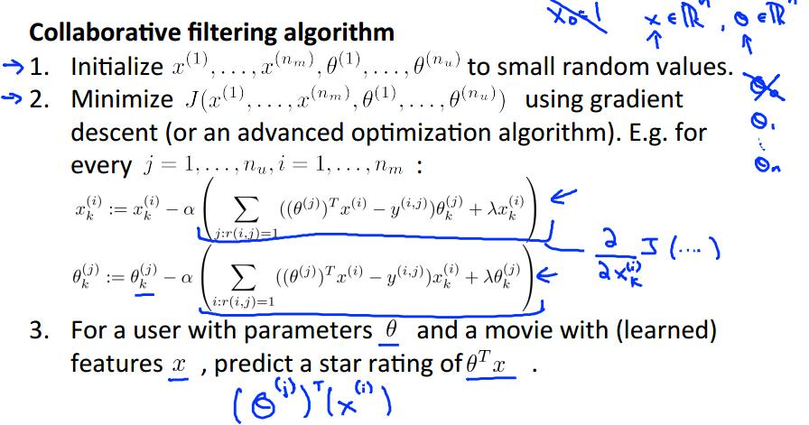
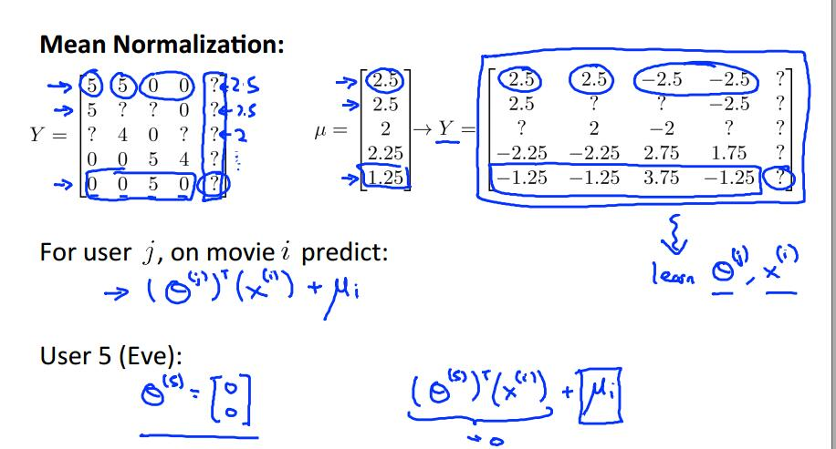
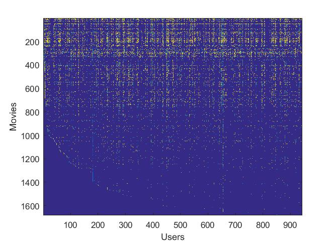

# 推荐系统设计

​		我们希望利用机器学习的算法设计这样一个推荐系统：包含若干电影和一些注册用户，已有数据是每个用户对一些看过电影的评分记录，任务是根据某个用户的评分记录为他推荐相关的同类型电影。首先定义一些符号：
$$
n_u=np.users,\ n_m=no.movies,\\ r(i,j)=1\ if \ user\ j\ rated\ movie\ i,\\   y^{(i,j)}=rating\ given\ by\ user\ j\ to\ movie\ i
$$

| movies               | Alice | Bob  | Caro | Dave |
| -------------------- | :---- | ---- | ---- | ---- |
| Love at last         | 5     | 5    | 0    | 0    |
| Romance forever      | 5     | ?    | ?    | 0    |
| Cute puppies of love | ?     | 4    | 0    | ?    |
| Nonstop car chases   | 0     | 0    | 5    | 4    |
| Sword vs. karate     | 0     | 0    | 5    | ?    |

<center>表1</center> 


## 基于内容的推荐系统

​		如果对于每一部电影 i ，我们都已知一个特征向量 $x^{(i)}=[x_1,x_2\dots x_n]$ 作为其描述，如以表一为例，假设对于一部电影的描述特征向量包括两个维度：第一个维度表示电影是一部爱情片的程度，第二个维度表示电影的动作片的程度。那么表一中可能有： $x^{(1)}=[1,0.99,0]^t$ ， $x^{(4)}=[1,0,0.99] $ ，从表中可以看出第一个人 Alice 明显对爱情类的电影给出了更高的分数，因此对于 Alice 而言表征她的特征向量可能是：$\theta^{(1)}=[0,5,0]^t$ ，这样根据每个电影已有的特征向量和每个人的喜好特征 $\theta$ 做为特征系数根据评分做线性回归，求出每个人的 $\theta$ 。那么每个人的评分则可以由 $r(i,j) = (x^{(i)})^t\theta^{(j)}$ 求得。

​		符号说明：
$$
\begin{aligned}
& \theta^{(j)}=parameter\ vector\ for\ user\ j\\
& x^{(i)} = feature\ vector\ for\ movie\ i\\
& For\ user\ j,\ movie\ i,\ predict\ rating:\ (\theta^{(i)})^T(x^{(i)})\\
& m^{(j)} = no. \ of\ movies\ rated\ by\ user\ j\\
& To\ learn \ \theta^{(j)}
\end{aligned}
$$
​		优化目标：
$$
\begin{aligned}
& To\ learn\ \theta^{(j)}\ (parameter\ for\ user\ j):\\
&\qquad\qquad \min_{\theta^{(j)}}\frac{1}{2}\sum_{i:r(i,j)=1}((\theta^{(j)})^Tx^{(i)}-y^{(i,j)})^2+\frac{\lambda}{2}\sum_{k=1}^{n}(\theta_k^{(j)})^2\\
& To\ learn\ \theta^{(1)},\ \theta^{(2)},\ \dots\ ,\theta^{(n_u)} :\\
& \qquad \qquad \min_{\theta^{(1)},\ \theta^{(2)},\ \dots\ ,\theta^{(n_u)}}\frac{1}{2}\sum_{j=1}^{n_u}\sum_{i:r(i,j)}((\theta^{(j)})^Tx^{(i)}-y^{(i,j)})^2+\frac{\lambda}{2}\sum_{j=1}^{n_u}\sum_{k=1}^{n}(\theta_k^{(j)})^2
\end{aligned}
$$
​		梯度下降算法：
$$
\begin{aligned}
&\theta^{(j)}:=\theta^{(j)}-\alpha\sum_{i:r(i,j)=1}((\theta^{(j)})^Tx^{(i)}-y^{(i,j)})x^{i}_k\ (for\ k=0)\\
&\theta^{(j)}:=\theta^{(j)}-\alpha(\sum_{i:r(i,j)=1}((\theta^{(j)})^Tx^{(i)}-y^{(i,j)})x^{i}_k +\lambda\theta^{(j)}_k)\ (for\ k\ne0)
\end{aligned}
$$
​		实际上就是对所有电影对每个人做线性回归。


## 协同过滤

​		上一节的算法建立在一个重要的前提之下，就是我们需要事先知道每部电影的特征向量，但实际上我们很难清楚的得到，或者清楚地对每一部电影进行评价，以得到其特征向量，那么是否可以通过学习算法自动的形成每一部电影的特征向量呢？答案是可行的，利用矩阵的低秩分解或者叫做协同过滤的方法即可实现。注意目前我们的条件变化：$x^{(i)}$ 不再是已知的，也需要作为求解的一部分。

​		方法的基本思路：
$$
\begin{aligned}
& Given \ \theta^{(1)},\ \theta^{(2)},\ \dots\ ,\theta^{(n_u)},\ to\ learn \ x^{(i)}:\\
& \qquad\qquad \min_{x^{(i)}}\frac{1}{2}\sum_{i:r(i,j)=1}((\theta^{(j)})^Tx^{(i)}-y^{(i,j)})^2+\frac{1}{2}\sum_{k=1}^n(x_k^{(i)})^2\\
& Given\ \theta^{(1)},\ \theta^{(2)},\ \dots\ ,\theta^{(n_u)},\ to\ learn \ x^{(i)},\ \dots\ ,x^{(n_m)}:\\
& \qquad\qquad \min_{x^{(1)},\ x^{(2)},\ \dots\ ,x^{(n_m)}}\frac{1}{2}\sum_{j=1}^{n_u}\sum_{i:r(i,j)}((\theta^{(j)})^Tx^{(i)}-y^{(i,j)})^2+\frac{\lambda}{2}\sum_{i=1}^{n_m}\sum_{k=1}^{n}(x_k^{(i)})^2
\end{aligned}
$$
​		协同过滤，首先随机初始化 $x$ ，然后根据 x 估计 $\theta$ , 然后再根据计算的 $\theta$ 估计 x， 再估计 $\theta$ ，再估计 x ... ...不断往复。

​		协同过滤优化目标：
$$
\begin{aligned}
& Given\ x^{(1)},\ x^{(2)},\ \dots\ ,x^{(n_u)},\ to\ learn \ x^{(i)},\ \dots\ ,x^{(n_u)}:\\
& \qquad\qquad \min_{\theta^{(1)},\ \theta^{(2)},\ \dots\ ,\theta^{(n_u)}}\frac{1}{2}\sum_{j=1}^{n_u}\sum_{i:r(i,j)}((\theta^{(j)})^Tx^{(i)}-y^{(i,j)})^2+\frac{\lambda}{2}\sum_{i=1}^{n_u}\sum_{k=1}^{n}(\theta_k^{(i)})^2
\\
& Given\ \theta^{(1)},\ \theta^{(2)},\ \dots\ ,\theta^{(n_u)},\ to\ learn \ x^{(i)},\ \dots\ ,x^{(n_m)}:\\
& \qquad\qquad \min_{x^{(1)},\ x^{(2)},\ \dots\ ,x^{(n_m)}}\frac{1}{2}\sum_{j=1}^{n_u}\sum_{i:r(i,j)}((\theta^{(j)})^Tx^{(i)}-y^{(i,j)})^2+\frac{\lambda}{2}\sum_{i=1}^{n_m}\sum_{k=1}^{n}(x_k^{(i)})^2
\\
& Minimizing\ \ x^{(1)},\ x^{(2)},\ \dots\ ,x^{(n_u)},\ and \  \theta^{(1)},\ \theta^{(2)},\ \dots\ ,\theta^{(n_u)}\ simulateously:\\
& \qquad\qquad J(x^{(1)},\ x^{(2)},\ \dots\ ,x^{(n_u)}, \theta^{(1)},\ \theta^{(2)},\ \dots\ ,\theta^{(n_u)})=\\
& \qquad\qquad
\frac{1}{2}\sum_{j=1}^{n_u}\sum_{i:r(i,j)}((\theta^{(j)})^Tx^{(i)}-y^{(i,j)})^2+\frac{\lambda}{2}\sum_{i=1}^{n_u}\sum_{k=1}^{n}(\theta_k^{(i)})^2+\frac{\lambda}{2}\sum_{i=1}^{n_m}\sum_{k=1}^{n}(x_k^{(i)})^2\\
& \qquad\qquad \min_{x^{(1)},\ x^{(2)},\ \dots\ ,x^{(n_u)},\\ \theta^{(1)},\ \theta^{(2)},\ \dots\ ,\theta^{(n_u)}}J(x^{(1)},\ x^{(2)},\ \dots\ ,x^{(n_u)}, \theta^{(1)},\ \theta^{(2)},\ \dots\ ,\theta^{(n_u)})
\end{aligned}
$$



## 实现细节：均值规范化

​		以上的讨论中已经基本包含了一个简单推荐系统的设计核心思想，但还有些实现细节需要讨论。比如，一个新注册的用户还未对任何电影进行评价，这时候如何为其推荐呢？一种考虑是假定他对所有的电影评分为 0 ，以此对他进行初始化，但是这样的话在回归算法结束后会发现这个用户的偏好特征 $\theta$ 是一个 0 向量（他对任何电影都不感兴趣）。这样显然是不太合理的，一般情况下可以考虑用某一部电影的平均评分为他初始化，那么如何使这个过程在算法过程中更方便呢？见下图：



​		Y 矩阵的每一行是一部电影的不同用户评分，首先求出每部电影的平均分，然后用 Y 矩阵的每个用户减去该部电影的平均分，相应的改变最后预测评分的公式：在特征向量做内积后加上平均分。这样做的好处的是，对于一部电影都没评价过的用户而言，可以放心的将所有评分都设置为 0 。


## 应用实例：

​		程序：machine-learning-ex8/ex8/ex8_cofi.m

​		文档：machine-learning-ex8/ex8.pdf

电影-用户的评分热点图：



算法核心 Cost Function ：

```matlab
function [J, grad] = cofiCostFunc(params, Y, R, num_users, num_movies, ...
                                  num_features, lambda)
%COFICOSTFUNC Collaborative filtering cost function
%   [J, grad] = COFICOSTFUNC(params, Y, R, num_users, num_movies, ...
%   num_features, lambda) returns the cost and gradient for the
%   collaborative filtering problem.
%

% Unfold the U and W matrices from params
X = reshape(params(1:num_movies*num_features), num_movies, num_features);
Theta = reshape(params(num_movies*num_features+1:end), ...
                num_users, num_features);

            
% You need to return the following values correctly
J = 0;
X_grad = zeros(size(X));
Theta_grad = zeros(size(Theta));

% ====================== YOUR CODE HERE ======================
% Instructions: Compute the cost function and gradient for collaborative
%               filtering. Concretely, you should first implement the cost
%               function (without regularization) and make sure it is
%               matches our costs. After that, you should implement the 
%               gradient and use the checkCostFunction routine to check
%               that the gradient is correct. Finally, you should implement
%               regularization.
%
% Notes: X - num_movies  x num_features matrix of movie features
%        Theta - num_users  x num_features matrix of user features
%        Y - num_movies x num_users matrix of user ratings of movies
%        R - num_movies x num_users matrix, where R(i, j) = 1 if the 
%            i-th movie was rated by the j-th user
%
% You should set the following variables correctly:
%
%        X_grad - num_movies x num_features matrix, containing the 
%                 partial derivatives w.r.t. to each element of X
%        Theta_grad - num_users x num_features matrix, containing the 
%                     partial derivatives w.r.t. to each element of Theta
%

% for i = 1:num_movies
%     for j = 1:num_users
%         if R(i,j) == 1
%             J = J + (Theta(j,:)*X(i,:)'-Y(i,j)).^2;
%         end
%     end
% end

J = sum(sum(((X*Theta'-Y).*R).^2));

J = J./2 + lambda/2*sum(sum(Theta.^2)) + lambda/2*sum(sum(X.^2));

delta = (X*Theta'-Y).*R;

X_grad = delta*Theta + lambda.*X;

Theta_grad = delta'*X + lambda.*Theta;


% =============================================================

grad = [X_grad(:); Theta_grad(:)];

end

```


模拟一个新用户，给出评分，由系统给出推荐：


