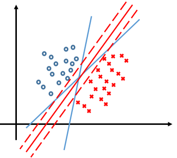
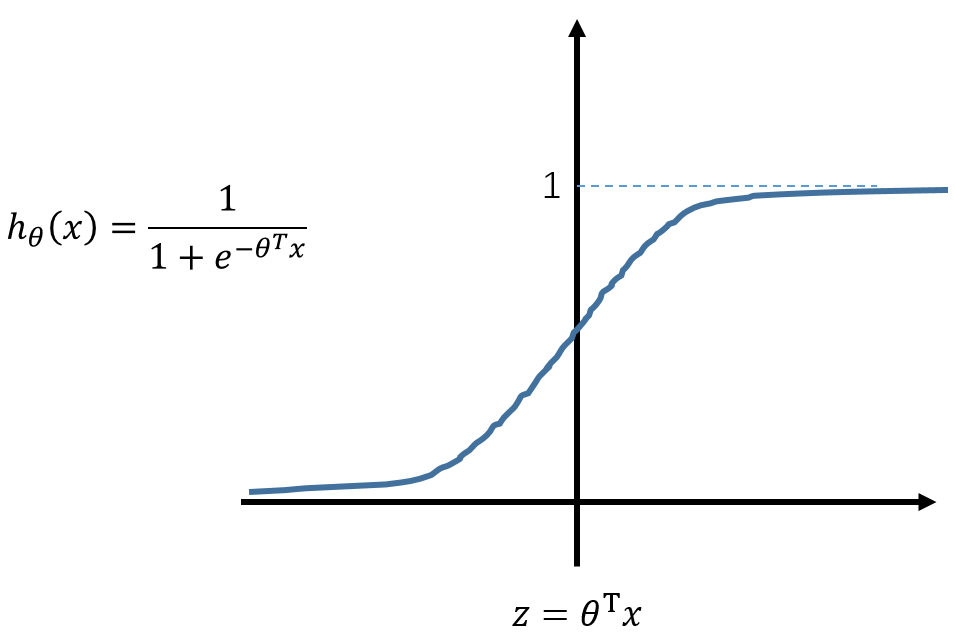
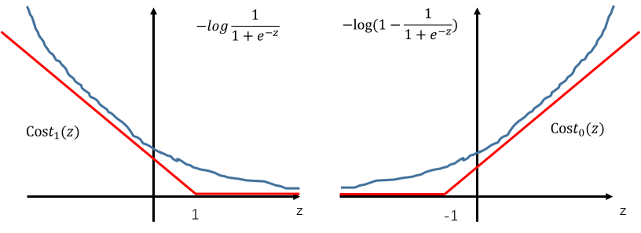
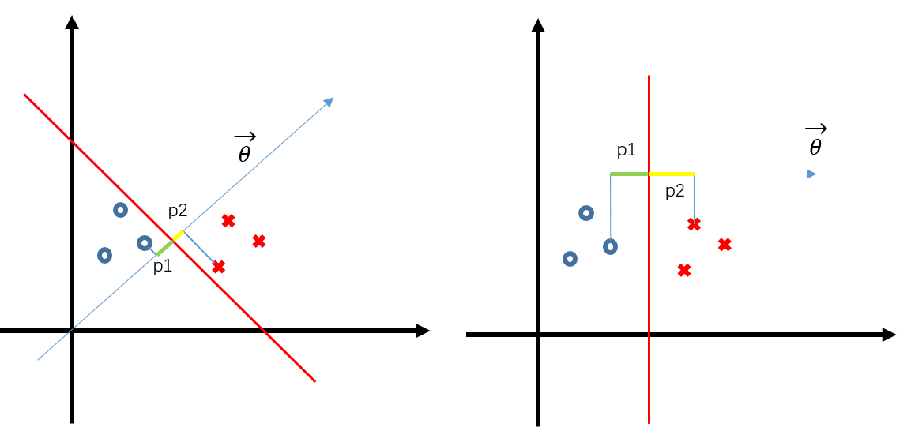
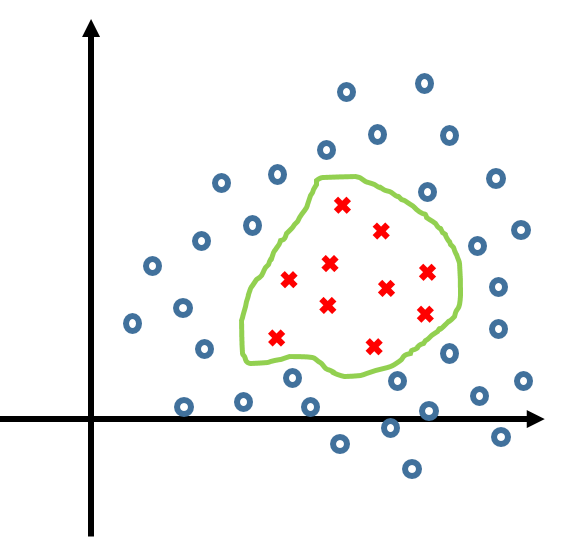
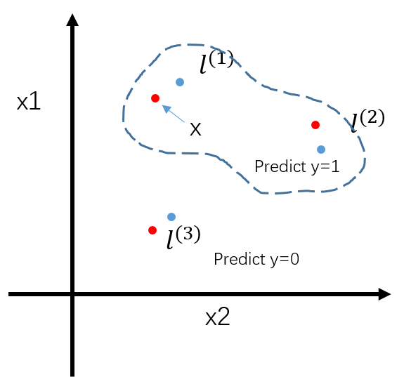

# 支持向量机

​		支持向量机（support vector machine）是一种对样本进行分类的算法，与逻辑回归在某种程度上有一定的相似性。与之不同的是，支持向量机会在样本之间 “容忍性” 最好的一个超平面。所谓 “容忍性” 最好是指该超平面到两个分类的样本距离会尽量大。如图中所，虽然三条实线都可以对两个分类的样本进行划分，但对于支持向量机而言更有可能选择红色实线。

## 优化目标

​		首先从逻辑回归的非线性函数 sigmoid 函数说起：

​		对于逻辑回归时的一个样本而言，当 y=1 时， 我们希望 $h_\theta(x)\approx 1,\quad\theta^T\gg 0$ ， 当 y=0 时，我们希望 $h_\theta(x)\approx0,\quad \theta^Tx\ll0$  ，此时逻辑回归的 Cost Function （对于一个样本）：
$$
\left.\begin{aligned}
  & -(y\log h_\theta(x) + (1-y)\log (1-h_\theta(x)))\\
= & -y\log \frac{1}{1+e^{-\theta^Tx}} - (1-y) \log(1-\frac{1}{1+e^{\theta^Tx}})
\end{aligned}\right.
$$
​		将这两个部分分开来看，下图中蓝色的线是逻辑回归的代价函数，对于逻辑回归我们只考虑 $\theta^Tx$ 的符号，若大于零则预测为 1 ， 小于零则预测为 0 。

​		在支持向量机中我们希望这个边界条件更强一些，对于 $\theta^Tx$ ，当大于 1 时才预测为 1 （此时对应左图 cost function 为 0 即不惩罚）， 当小于 1 时才预测为 0 。并且，相对于逻辑回归的 Cost Function 是非线性的，支持向量机在决策边界之外的部分采用线性函数，这样会大大提高求导速度以及支持向量机的效率。

​		因此，支持向量机的 Cost Function 形式：
$$
\min_\theta C\sum_{i=1}^{m}[y^{(i)}cost_1(\theta^Tx^{(i)})+(1-y^{(i)})cost_0(\theta^Tx^{(i)})]+\frac{1}{2}\sum_{i=1}^n\theta^2
$$
注意该式的第二项任然是正则化项，但正则化系数 C 乘在了第一项上，可以理解为 $C=\frac{1}{\lambda}$ 

## 大间隔分类的数学原理

​		回到（1）式，可以这样理解，即要寻找一个 $\theta$ 使得（1）式达到最小值，因而这个 $\theta$ 是变动的，可选的，只能能达到最小化（1）的目标，任何 $\theta$ 都可以。这样一来，对于一个某一个类别 y=1 的样本而言，（1）式前半部分只有 cost1 起作用，此时挑选 $\theta$ 使得 $\theta^Tx\ge1$ 则可以让前半部分为 0 。观察（1）可以发现前半部分起到分类的作用，即一旦分类预测错误产生的惩罚由前半部分表示，此时也就不难考虑 C 的作用： 当 C 取一个很大的值时，即意味着预测错误时产生的惩罚很大，算法会尽量使得每一个样本分类正确，因而会产生类似过拟合的效果，对误差样本的包容性不好。 

​		假设我们的 C 值较大，表示算法主要还是以分类准确为主，（即分类预测错误产生的惩罚会远大于后面正则化项的惩罚，需要优先考虑），因此，（1）式就可以转化为以下形式的优化问题：
$$
\left . \begin{aligned}
& min \quad\frac{1}{2}\sum_{j=1}^n \theta^2_j\\
& s.t. \quad\theta^Tx^{(i)}\ge1 \quad if\ y^{(i)}=1\\
& \quad\quad\ \ \  \theta^Tx^{(i)}\le-1 \quad if\ y^{(i)}=0
\end{aligned}\right. \tag {*}
$$
​		为了理解为什么支持向量机能够完成大间隔分类的任务，先从向量内积说起。对于 u、v两个向量，其内积等于二者坐标对应相乘相加，几何定义为 $\vec{u}\sdot\vec v=||\vec u||\sdot||\vec v||\sdot\cos(\vec u, \vec v)$ ，其中定义 $p = ||\vec u||\sdot\cos(\vec u, \vec v)$ （即 u 向 v 的投影量） 。如果 u、v 为两个列向量，则此时二者内积定义为 $u^Tv=p\sdot||v||$ ，两道竖线代表向量的模长。于是（*）式即可改写为：
$$
\left . \begin{aligned}
& min \quad\frac{1}{2}||\theta||^2\\
& s.t. \quad p^{(i)}\sdot||\theta||\ge1 \quad if\ y^{(i)}=1\\
& \quad\quad\ \ \  p^{(i)}\sdot||\theta||\le-1 \quad if\ y^{(i)}=0
\end{aligned}\right. \tag {**}
$$

​		将 $\theta$ 视为一个向量， $p^{(i)}$ 表示第 i 个样本在向量在 $\theta$ 方向上的投影，于是（**）表达的最优化问题即为在满足分类正确（或者大部分样本分类正确）得前下，使得 $\theta$ 的模长最小。

​		注意，由于将 $\theta$ 视为一个向量，由本节的第一幅图可以看出实际上的决策边界是三条红色的线，其中两条虚线表示  $\theta^Tx=\pm1$ 红色实线表示  $\theta^Tx=0$ ，我们通常还是将  $\theta^Tx=0$  作为决策边界。因此，作为决策边界的线（三维空间中是面） x 是与 $\theta$ 垂直的。

​		于是从下图中更加直观的理解大间隔分类：

​		假设样本分布如图所示，如果决策边界（红线）选择了左边，p1、p2分别是两个样本在 $\theta$ 上的投影，可以看出此时的 p1、p2都比较小，于是为了能够正确分类，（**）中 $\theta$ 的模就会很大以达到 s.t. 的约束。但是如果决策边界是右图的话 p1、p2本身就比较大，此时就能够取得更小的 $\theta$ 。这就是支持向量机能够形成类似右图的决策边界的原因，实质上是由优化的目标函数所决定的。

## 核函数

​		以上所讨论样本分布都是可以用一个超平面来切分的，如果是非线性的决策边界呢？在逻辑回归中使用了多项式回归解决这一问题：

$$
\theta_0+\theta_1x_1+\theta_2x_2+\theta_3x_1x_2+\theta_4x_1^2+\theta_5x_2^2\dots
$$
​		但在实际处理中我们依然考虑成线性回归的形式：
$$
\theta_0+\theta_1f_1+\theta_2f_2+\theta_3f_3+\theta_4f_4+\theta_5f_5\dots\\ f_1=x_1,f_2=x_2,f_3=x_1x_2,f_4=x_1^2,f_5=x_2^2\dots
$$
​		显然 f 可以看做是由 x 得到的更加复杂的特征形式，在支持向量机中使用的 f 与（3）式不尽相同，首先在平面上定义一些标记点（landmarks） $l^{(1)},l^{(2)},l^{(3)},\dots$ 

​		对于一个给定的样本（在平面上维度与 l 一致），定义 f :
$$
f_1 = similarity(x,l^{(1)})=\exp(-\frac{||x-l^{(1)}||}{2\sigma^2})\\
f_2 = similarity(x,l^{(2)})=\exp(-\frac{||x-l^{(2)}||}{2\sigma^2})\\
f_3 = similarity(x,l^{(3)})=\exp(-\frac{||x-l^{(3)}||}{2\sigma^2})\\
...
$$
​		此时 f 是一个用于描述样本 x 和 标记点 l 之间相似度的函数，称为核函数，这里的核函数实际上就是高斯函数。它具有这样的性质：当 x 和 l 十分相近时，f 的值接近于 1 ，反之则接近于 0 。下面通过一个例子理解核函数的作用：

​		图中的蓝点表示标记点，红点表示样本点，假设我们已经得到一个SVM形式如下：
$$
\left.\begin{aligned}
& h = \theta_0+\theta_1f_1+\theta_2f_2+\theta_3f_3\\
& f_i = similarity(x,l^{(i)})\\
& \theta_0=-0.5,\quad\theta_1=1,\quad\theta_2=1,\quad\theta_3=0\\
& predict\quad y=1 \quad when \quad h \ge 0\\
& predict\quad y=0 \quad when \quad h \lt 0\\
\end{aligned}\right.
$$
​		所以，对于图中标记出的样本点 x ，由于十分接近 $l^{(1)}$ ，因而 $f_1\approx 1,f_2\approx 0,f_3\approx 0\rightarrow h=0.5\ge0$ ，因此 x 的预测值为 1 。另外两个点同样的分析方法可知靠近 $l^{(2)}$ 的 x 都会被预测为 1 ， 靠近 $l^{(3)}$的 x 会被预测为 0，最终得到一条大概的决策边界。

​		由此可见标记点决定了最终SVM的决策边界，在实际问题中，通常就以所有的样本点作为标记点，假设共有 m 个样本点，即
$$
f_1 = similarity(x,x^{(1)})\\
f_2 = similarity(x,x^{(2)})\\
...\\
f_m = similarity(x,x^{(m)})
$$
​		对于训练数据而言：
$$
x^{(i)}\rightarrow
\left.\begin{matrix}
f_1^{(i)} = similarity(x^{(i)},x^{(1)})\\
f_2^{(i)} = similarity(x^{(i)},x^{(2)})\\
\vdots\\
f_i^{(i)} = similarity(x^{(i)},x^{(i)})=1\\
\vdots\\
f_m^{(i)} = similarity(x^{(i)},x^{(m)})
\end{matrix}\right.
$$
​		组织训练数据 x 为矩阵形式（每个样本为一行），则经过 f 函数映射后的新的特征矩阵 F 是一个对角线元素全为 1 的 $m\times m$ （f 的个数由样本数决定）实对称方阵。由于在和 $\theta$ 相乘时还有一项常数项 $\theta_0$ 故还需要为 F 第一列添加 1 ，此时的 f 长度为 m+1 。相应的 $\theta$ 的维度也是 m+1 。于是，最终的优化目标的形式：
$$
\min_\theta C\sum_{i=1}^{m}[y^{(i)}cost_1(\theta^Tf^{(i)})+(1-y^{(i)})cost_0(\theta^Tf^{(i)})]+\frac{1}{2}\sum_{i=1}^m\theta^2
$$
​		另外值得一提的是，关于核函数，也可以取别的，比如最简单的线性核，选择核函数为别的评价两点相似度的函数 $||x-l^{(i)}||^2$ 也是可行的。

 

