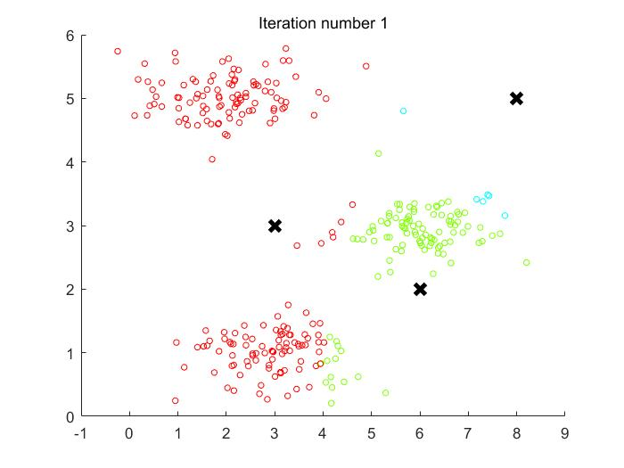
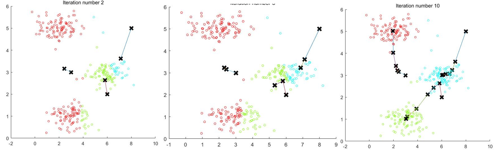
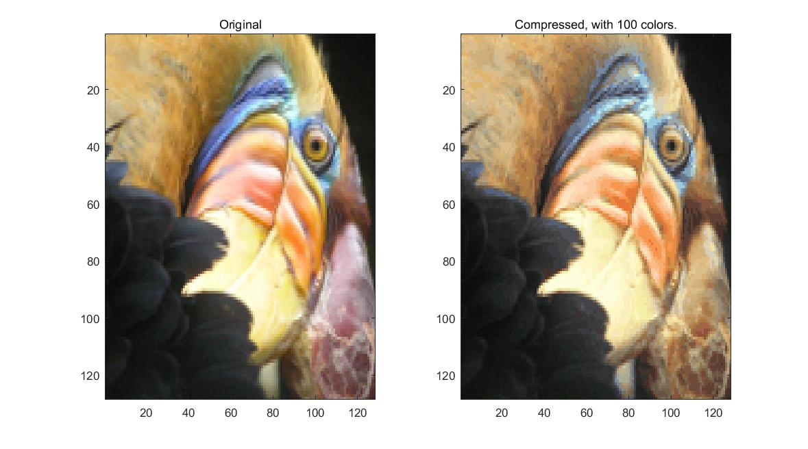

# 无监督学习

​		无监督学习是建立在一类事先不知道其具体分类的样本集上的机器学习任务，由于事先不知道样本之间的明显差异，即样本的分类，因此样本时没有标签的，对于这样的样本集合，我们希望的是能够用机器学习的方法自动的为样本分类，也叫做聚类算法（Clusting）。本节主要介绍的算法是 K 均值聚类。

## K 均值算法（ K-means algorithm ）

_看图王.png)		

​		以图示的样本集合为例， K 均值算法的思想非常简单，需要人为给出样本划分的类的数目 n，然后 K 均值会生成 n 个类的样本中心点，算法的最后会使得所有的样本到各自的样本中心点的距离达到最小。

​		假设图示集合分为两类。算法开始，首先在特征空间内随机两个标记点，代表划分的两个类。然后，循环每一个样本点，计算该样本点和这两个标记点的距离，比较二者大小，样本点离哪一个标记点近就将其标记为哪一类。一轮结束后所有样本点都有了自己的类别，此时循环每一个类，对于该类内的所有样本点，计算它们的中心点，作为下一次迭代时该类的标记点。这一操作将更新所有的样本标记点，重复这两个步骤，重新为样本划分类，再次更新样本中心，直到规定轮次或者样本中心不再变化（或者样本划分不再改变）。

​		用伪代码描述：
$$
\left.\begin{aligned}
&Randomly\ initialize\ K\ clusters\ \mu_1,\mu_2,\dots,\mu_k\ \in\R^n\\
&Repeat\{\\
& \qquad \qquad for\ i=1\ to\ m\\
& \qquad \qquad \qquad c^{(i)}:=index(from\ 1\ to\ k)\ of\ clusters\ centroid\ closet\ to\ x^{(i)}\\
& \qquad \qquad for\ k=1\ to\ K\\
& \qquad \qquad \qquad \mu_k:=average(mean)\ of\ points\ assigned\ to\ cluster\ k \\
&\qquad \qquad \}
\end{aligned}\right.
$$

## 随机初始化

​		对于 K 均值算法而言，分类标记的初始化位置很大程度上影响着最后的聚类效果，可能有的起始位置能够得到较好的结果，但有的起始位置就不能得到较好的结果。需要明确的是评价 K 均值聚类好坏的标准是，在完成聚类后，所有样本点到达各自分类中心点的距离的和达到最小。因此，能够想到的是，在 K 均值算法外再嵌套一层循环，每一次循环开始都随机生成分类中心点，然后执行聚类，直到收敛后计算所有样本点到达各自分类中心点的距离的和，选择指定迭代次数内这个值最小的聚类结果。

​		伪代码描述即为：
$$
\left.\begin{aligned}
&For\ i=1\ to\ 100\{\\
&\qquad \qquad Randomly\ initialize\ K-means.\\
&\qquad \qquad Run\ K-means.\ Get\ c^{(1)},\dots,c^{(m)},\mu_1,\dots,\mu_K.\\
&\qquad \qquad Compute\ cost\ function\ (distortion)\\
&\qquad \qquad \qquad \qquad J(c^{(1)},\dots,c^{(m)},\mu_1,\dots,\mu_K)\\
&\qquad \qquad \}\\
&Pick\ clustering\ that\ gave\ lowest\ cost\ J(c^{(1)},\dots,c^{(m)},\mu_1,\dots,\mu_K)
\end{aligned}\right.\\
$$

## 应用实例

​		程序：machine-learning-ex7/ex7/ex7.m

​		文档：machine-learning-ex7/ex7.pdf

​		

### K 均值算法

​		样本点分布情况（x 表示类别标记点）：

​		中间迭代结果

### K 均值算法用于图像压缩

​		对于一张 RGB 的彩色图像，每一个像素点是一个三维向量，分别代表 R、G、B 的值，每一个值取值在 0-255 范围内。 K 均值算法用于图像压缩的思想在于，将每一个像素点视为一个样本，对一张图片的所有像素点进行聚类，规定一张彩色图片的色彩类型仅有 100 种，则进行一个 100 类的聚类任务，当聚类完成后各个类的中心点即是平均色彩值记录下它们，而原图中每个像素只需用一个整数标记其类别即可，这样就大大减少了图片的存储空间。当聚类的类别数目越多则压缩图像越接近原图。

