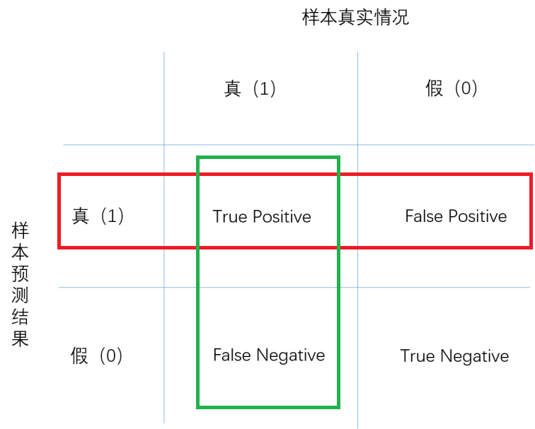
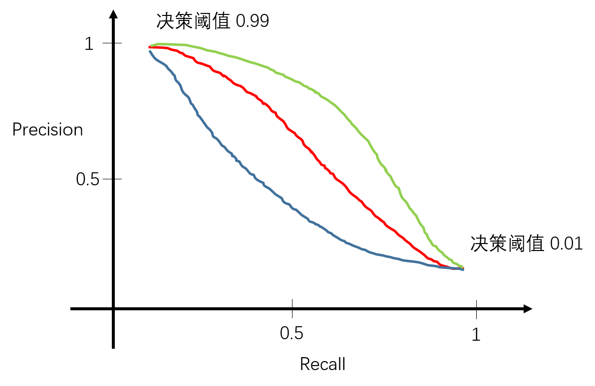

# 机器学习系统设计

​		本节承接上一节的主题，将在能够对一个系统模型进行评价的基础之上讨论某些特殊样本分布的情况下如何确保我们真正了解系统是否有效工作。

## 误差分析以及不对称性分类的误差评估

> Recommended approach  
>
> - Start with a simple algorithm that you can implement quickly.    Implement it and test it on your crossPvalida3on data.    
> - Plot learning curves to decide if more data, more features, etc.  are likely to help.    
> -  Error analysis:  Manually examine the examples  (in cross valida3on set) that your algorithm made errors on. See if you spot any systematc trend in what type of examples it is making errors on.  

​		以癌症数据样本的分类为例，假设现有模型对一批患者数据进行分类，发现模型在测试样本集的错误率仅 1% （意味着 99% ）的正确率。这个结果看上去十分不错，但如果样本中仅有 0.5% 的比例是患癌症的，那么如果执行一个非机器学习算法：对所有输入样本都返回 0 （即判断不患癌症），由于不患癌症的比例非常大，因此对于这样一个算法的正确率也很高。

​		显然这样的样本分布会使得我们原有的评估系统不再能够准确地评价模型好坏，对于这样正反样本非均匀分布的，叫做非对称性分类任务。解决办法是引入评价指标——查准率（precision）、召回率（recall）

​		将预测结果归入上图的表中，

​		查准率定义为： 
$$
Precision=\frac{TruePositive}{TruePositive+FalsePositive}
$$
也就是对于预测为 “真” 的样本，预测正确数目与总数之比。

​		召回率定义为：
$$
Recall = \frac{TruePositive}{TruePositve+FalseNegative}
$$
也就是对于实际为 “真” 的样本，预测正确数与总数之比。

​		对于一个能够准确表达样本的模型而言，其查准率和召回率都应该比较高。

## 查准率和召回率的权衡

​		通常而言，在逻辑回归中我们使得判断正例和反例的界限（决策边界）设置为 0.5 ， 即假设函数的输出值大于 0.5 时预测值 y=1 ，反之 y=0 。但某些情况下我们想要根据实际修改这个阈值以使得模型更加适用。比如，在癌症患者预测的例子中，我们希望系统在预测病人患上癌症时的置信度高一些，于是设置决策边界为 0.9 ，即大于等于 0.9 的输出才认为是癌症。这会使得结果查准率偏高，召回率偏低；如果我们希望不漏掉任何一个可能患上癌症的病人，则可以设置决策边界小一些，比如当置信度大于等于 0.3 时即判断该病人患上癌症，这样会使得结果的查准率偏低而召回率偏高。这两者可能的关系如下图所示：

		假设我们现在有若干个模型，它们可能是同一个算法取了不同的参数，也可能是不同的算法，那么该如何评价这些模型呢，用查准率和召回率显然不太直观。

|            | Precision(P) | Recall(R) | average | F1 Score |
| ---------- | ------------ | --------- | ------- | -------- |
| Algorithm1 | 0.5          | 0.4       | 0.45    | 0.444    |
| Algorithm2 | 0.7          | 0.1       | 0.40    | 0.175    |
| Algorithm3 | 0.02         | 1.0       | 0.51    | 0.0392   |

​		我们想要根据查准率和召回率构造一个更加直观的量来评价一个系统，首先想到的是二者的平均值。从上表的第四列可以看出，对两个参量求均值以后得分最高的系统是第三个，但是第三个算法有着非常高的召回率，和几乎为零的查准率，这意味着模型三只要固定返回 1 就可以达到这个结果，因为模型几乎不判假，所以 FalseNegative 一项几乎为 0 ，而 FalsePositive 会非常大。这样的模型显然不是我们想要的，因此，取均值的办法是行不通的。

​		于是，引入 $F_1Score$ ，定义为：
$$
F_1Scroe=2\frac{PR}{P+R}
$$
F1值的分子为二者的乘积，这意味着二者只要有一个较小，最后的评价都不会太高，只有当二者都比较均衡的较大的时候F1值才会较好，从表中的第五列可以看出，最后评分较高的是模型一。

