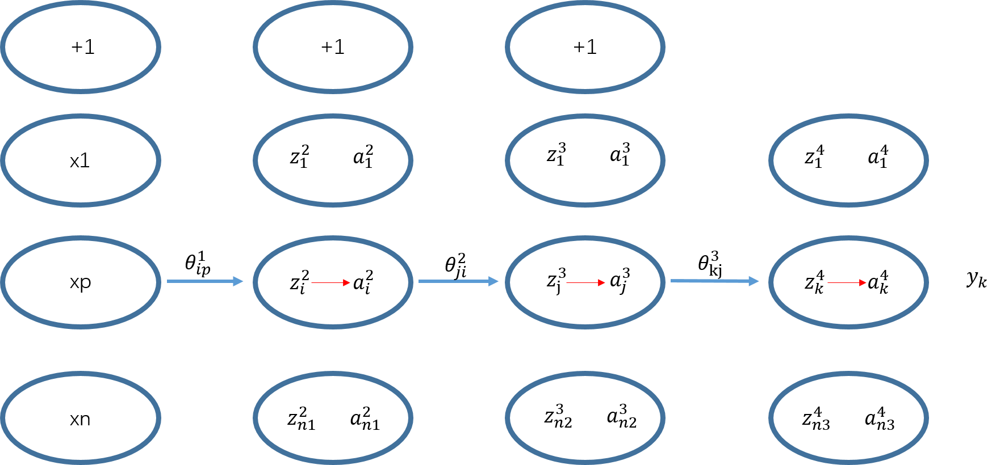
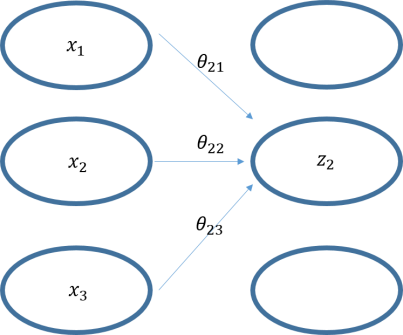
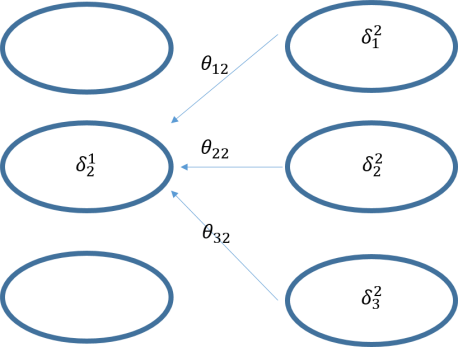
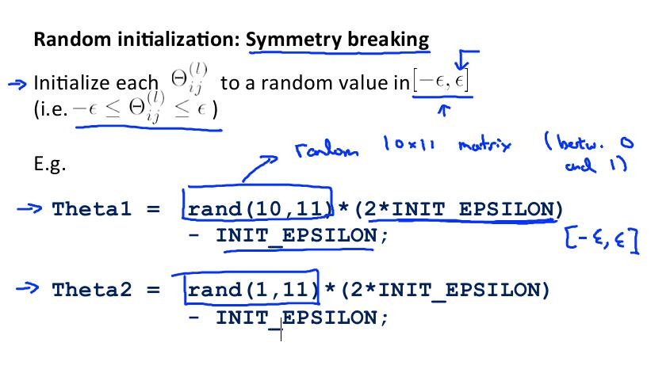
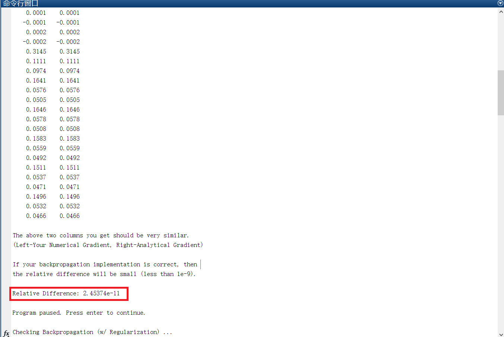
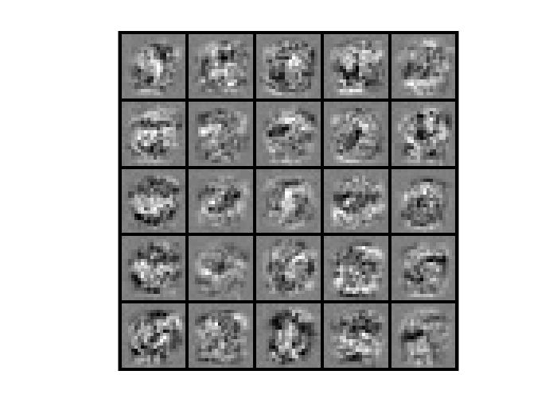

# 神经网络参数及反向传播算法（二）

​		上一节推导的神经网络反向传播算法基于的 cost function 为均方误差函数，实际应用中，参考 Logistic 回归的形式定义的 cost function 和均方误差形式有所区别，下图是本节的示例网络。



<center>图1</center>

​		如图所示的是一个包含了两个隐层的神经网络（仅画出了一条连接线，其余省略），用 l 标识层号，第一层为输入层包含了 n 个结点，结点序号用 p 标识。第二层，第三层为隐层分别有 n1 ， n2 个结点，结点的序号用 i ， j 标识。第四层为输出层包含 n3 个输出结点， 节点序号用 k 标识。每一层之间的连接权值用 $\theta_{ij}^l$ 表示， l 表示序号， i 表示后一层的结点序号， j 表示前一层的结点序号。假设样本空间仅包含一个样例 X ，则$x_1\dots x_n$ 为该样例的各个特征， $y_1\dots y_{n3}$ 为该样例的标签。令神经网络中的 $x_p=a_p^{1}$ 则 对于图中所有的 $z_j^l=\sum_{i=0}^{L}a_i^{l-1}\theta_{ji}^{l-1}$ （此处的 i , j 仅做标识，不与上图中对应，i 表示 j 的上一层， $l$ 表示层号，L表示第 i 层的总结点数目） ，图中的 $a_j^l=sigmoid(z_j^{l})$ 。


## Cost Function

​		Logistic 回归的 cost function：
$$
J(\theta)=-\frac{1}{m}\sum_{i=1}^m[y^{(i)}\log(h_\theta(x^{i}))+(1-y^{(i)})\log(1-h_\theta(x^{(i)}))]+\frac{\lambda}{2m}\sum_{j=1}^{n}\theta_j^2
$$
​		对于神经网络而言，先定义符号：
$$
L\ =\ total\ number\ of\ layers\ in\ the\ network\\
sl\ = \ number\ of\ units\ (not\ counting\ bias\ units)\ in\ layer\ l\\
K\ =\ number\ if\ output\ units/classes\quad\quad\quad\quad\quad\quad\quad\quad\quad\quad\\
$$
​		Cost Function 的形式会更复杂一些：
$$
J(\theta)=-\frac{1}{m}\sum_{i=1}^m\sum_{k=1}^{K}[y_k^{(i)}\log(h_\theta(x^{i})_k)+(1-y^{(i)}_k)\log(1-h_\theta(x^{(i)})_k)]+\frac{\lambda}{2m}\sum_{l=1}^{L-1}\sum_{i=1}^{sl}\sum_{j=1}^{sl+1}(\theta_{j,i}^{(l)})^2
$$
​		相比于 Logistic 回归的 cost function ，（3）式的前半部分增加了一个嵌套的累加，对应着神经网络输出层的所有结点，后半部分则是神经网络的所有权值的平方和构成的正则项。本文的推导将使用不包括正则项的 Cost Function 。
$$
J(\theta)=-\frac{1}{m}\sum_{i=1}^m\sum_{k=1}^{K}[y_k^{(i)}\log(h_\theta(x^{i})_k)+(1-y^{(i)}_k)\log(1-h_\theta(x^{(i)})_k)]
$$

## 结论写在前面

​		神经网络参数想要更新的关键在于对 Cost Function 以及相应偏导数的计算：
$$
J(\theta)\\
\frac{\partial}{\partial \theta_{i,j}^{(l)}}J(\theta)
$$
​		$J(\theta)$ 由（4）式计算，偏导数项在此先给出最终形式，证明和推导在后（参照（2）式的符号定义）：
$$
\frac{\partial}{\partial \theta_{i,j}^{(l)}}J(\theta)=a_j^{(l)}\delta_i^{(l+1)}\\
\delta_i^{l}=\left\{
\begin{aligned}
\delta_i^{L}= & a_i^{(L)}-y_i\\
\delta_i^{l}= & (\sum_{p=1}^{sl}\delta^{l+1}_p\theta_{pi}^{l})a_i^{l}(1-a_i^{l})
\end{aligned}
\right. \tag{*}
$$
​		

## 几点说明

（6）式说明，对于最后一层的 $\delta$ 直接用预测值和标签值相减即可，非最后一层的则照第二种情况计算。此外，对于 $\delta$ 还有矩阵形式的计算公式：
$$
\delta^{(l)} = (\Theta^{(l)})^T\delta^{(l+1)}.*a^{(l)}.*(1-a^{(l)})\quad l<L
$$
​		” .* “ 表示矩阵元素对应相乘。

​		说明：因为 $\Theta$ 为 $\theta$ 的矩阵，形式为：
$$
\Theta=\left[\begin{matrix}
\theta_{11}&\theta_{12}&\dots&\theta_{1n}\\
\theta_{21}&\theta_{22}&\dots&\theta_{2n}\\
\vdots&\vdots&\ddots&\vdots\\
\theta_{m1}&\theta_{m2}&\dots&\theta_{mn}\\
\end{matrix}\right]
$$
​		行表示为前一层神经网络的结点数目，列表示为后一层的结点数目，也就是说，每行对应后一层的一个神经元。考虑前向传播算法：
$$
Z=\left[\begin{matrix}
\theta_{11}&\theta_{12}&\dots&\theta_{1n}\\
\theta_{21}&\theta_{22}&\dots&\theta_{2n}\\
\vdots&\vdots&\ddots&\vdots\\
\theta_{m1}&\theta_{m2}&\dots&\theta_{mn}\\
\end{matrix}\right]
\left[\begin{matrix}
x_1\\
x_2\\
\vdots\\
x_n
\end{matrix}\right]
=
\left[\begin{matrix}
z_1\\
z_2\\
\vdots\\
z_m
\end{matrix}\right]
$$
​		实际上对于 $\delta$ 而言，其维度和 Z 是一致的，并且参照（*）式，累加符号的下标是按照 $\theta$

的列进行循环的，因而 （6）式中需要乘的是 $\Theta$ 的转置。

​		直观来说，观察 图2 前向传播计算，可以看出 $\theta$ 下标是固定行不动，列循环的。



<center>图2</center>

​		对比 图3 中的反向传播算法不难发现 $\theta$ 是固定列不动，行循环的。



<center>图3</center>


## 证明

​		

​		以 图1 的网络为例，证明（*）式。当只有一个样本时， （4）式退化为：
$$
J(\theta)=-\sum_{k=1}^{K}[y_k\log(a_k^4)+(1-y_k)\log(1-a_k^4)]
$$

* $\theta_{kj}^3$ 的偏导数

  由 “神经网络参数及反向传播算法（一）“（7）式可知 

$$
\frac{\partial a_k^4}{\partial z_k^4}=(a_k^4\sdot(1-a_k^4))
$$

​		因此，
$$
\left.\begin{aligned}
\frac{\partial J(\theta)}{\partial \theta_{kj}^3}
= & \frac{\partial J(\theta)}{\partial a_k^4}\sdot \frac{\partial a_k^4}{\partial z_k^4} \sdot \frac{\partial z_k^4}{\partial \theta_{kj}^3}\\
= & -(y_k\sdot\frac{1}{a_k^4}+(1-y_k)\frac{1}{1-a_k^4})\frac{\partial a_k^4}{\partial z_k^4} \sdot \frac{\partial z_k^4}{\partial \theta_{kj}^3}\\
= & -(y_k\sdot\frac{1}{a_k^4}+(1-y_k)\frac{1}{1-a_k^4})(a_k^4\sdot(1-a_k^4))\frac{\partial z_k^4}{\partial \theta_{kj}^3}\\
= & (a_k^4-y_k)a_j^3\\\\
= & \delta_k^4a_j^3
\end{aligned}\right. \tag{**}
$$

* $\theta_{ji}^2$ 的偏导数

$$
\left.\begin{aligned}
\frac{\partial J(\theta)}{\partial \theta_{ji}^2}
= & \sum_{k=1}^{n_3} \frac{\partial J(\theta)}{\partial a_k^4}\sdot \frac{\partial a_k^4}{\partial z_k^4} \sdot \frac{\partial z_k^4}{\partial a_j^3} \sdot \frac{\partial a_j^3}{\partial z_j^3} \sdot \frac{\partial z_j^3}{\partial \theta_{ji}^2}\\
= & \sum_{k=1}^{n_3} (a_k^4-y_k) \frac{\partial z_k^4}{\partial a_j^3} \sdot \frac{\partial a_j^3}{\partial z_j^3} \sdot \frac{\partial z_j^3}{\partial \theta_{ji}^2} \\
= & \sum_{k=1}^{n_3} (a_k^4-y_k) \theta_{ki}^3 \sdot \frac{\partial a_j^3}{\partial z_j^3} \sdot \frac{\partial z_j^3}{\partial \theta_{ji}^2} \\
= & \sum_{k=1}^{n_3} (a_k^4-y_k) \theta_{ki}^3 \sdot a_j^3(1-a_j^3) \sdot \frac{\partial z_j^3}{\partial \theta_{ji}^2} \\
= & \sum_{k=1}^{n_3} (a_k^4-y_k) \theta_{ki}^3 \sdot a_j^3(1-a_j^3) \sdot a_i^2 \\
= & \delta_j^3 \sdot a_i^2 \\ 
\end{aligned}\right. \tag{***}
$$

​		由（\*\*）、（\*\*\*）式联立可得：
$$
\delta_i^{l}=\left\{
\begin{aligned}
\delta_i^{L}= & a_i^{(L)}-y_i\\
\delta_i^{l}= & (\sum_{p=1}^{sl}\delta^{l+1}_p\theta_{pi}^{l})a_i^{l}(1-a_i^{l})
\end{aligned}
\right.
$$
或者其矩阵形式：
$$
\delta^{(l)} = (\Theta^{(l)})^T\delta^{(l+1)}.*a^{(l)}.*(1-a^{(l)})\quad l<L
$$


## 随机初始化参数

​		在 Logistic 回归中，我们通常初始化参数 $\theta$ 为 0 ，事实证明这样的初始化方式在 Logistic 回归中不会产生什么问题，但在神经网络中这样做将会产生问题。如图所示：


​		图中标记了四组相同颜色的权值参数，当全都初始化为 0 时，会导致前向传播过程中 $a_1=a_2$ ，从而反向传播时 $\delta_1^{(2)}=\delta_2^{(2)}$ ，由此将导致各组相同颜色的边的导数值相同，也就是说在一次梯度下降以后虽然各个参数不再是 0 ， 但它们两两相等，这是一种高度冗余的现象，将导致神经网络不能学习到更多的特征。因此在初始化时，应当将参数随机初始化到某个区间内。



​		其中 $\epsilon$ 的取值和神经网络的规模有关，一般也可以初始化参数在（-1,1）的正态分布区间内。

```matlab
function W = randInitializeWeights(L_in, L_out)
%RANDINITIALIZEWEIGHTS Randomly initialize the weights of a layer with L_in
%incoming connections and L_out outgoing connections
%   W = RANDINITIALIZEWEIGHTS(L_in, L_out) randomly initializes the weights 
%   of a layer with L_in incoming connections and L_out outgoing 
%   connections. 
%
%   Note that W should be set to a matrix of size(L_out, 1 + L_in) as
%   the first column of W handles the "bias" terms
%

% You need to return the following variables correctly 
W = zeros(L_out, 1 + L_in);

% ====================== YOUR CODE HERE ======================
% Instructions: Initialize W randomly so that we break the symmetry while
%               training the neural network.
%
% Note: The first column of W corresponds to the parameters for the bias unit
%

epsilon_init = sqrt(6)./(sqrt(L_in + L_out));
W = rand(L_out, 1 + L_in) * 2 * epsilon_init - epsilon_init;

% =========================================================================

end

```


## BP算法实现：手写数字识别

​		程序：\machine-learning-ex2\ex4.m

​		文档：\machine-learning-ex2\ex4.pdf

​		本节将实现包含一个隐层的神经网络在手写数字识别中的应用，关于任务的具体描述见\machine-learning-ex2\ex4.pdf文档有详细说明，此处只说明核心代码部分的注意要点。如下是计算 cost function 和 梯度 的函数。

```matlab
function [J grad] = nnCostFunction(nn_params, ...
                                   input_layer_size, ...
                                   hidden_layer_size, ...
                                   num_labels, ...
                                   X, y, lambda)
%NNCOSTFUNCTION Implements the neural network cost function for a two layer
%neural network which performs classification
%   [J grad] = NNCOSTFUNCTON(nn_params, hidden_layer_size, num_labels, ...
%   X, y, lambda) computes the cost and gradient of the neural network. The
%   parameters for the neural network are "unrolled" into the vector
%   nn_params and need to be converted back into the weight matrices. 
% 
%   The returned parameter grad should be a "unrolled" vector of the
%   partial derivatives of the neural network.
%

% Reshape nn_params back into the parameters Theta1 and Theta2, the weight matrices
% for our 2 layer neural network
Theta1 = reshape(nn_params(1:hidden_layer_size * (input_layer_size + 1)), ...
                 hidden_layer_size, (input_layer_size + 1));

Theta2 = reshape(nn_params((1 + (hidden_layer_size * (input_layer_size + 1))):end), ...
                 num_labels, (hidden_layer_size + 1));

% Setup some useful variables
m = size(X, 1);
         
% You need to return the following variables correctly 
J = 0;
Theta1_grad = zeros(size(Theta1));
Theta2_grad = zeros(size(Theta2));

% ====================== YOUR CODE HERE ======================
% Instructions: You should complete the code by working through the
%               following parts.
%
% Part 1: Feedforward the neural network and return the cost in the
%         variable J. After implementing Part 1, you can verify that your
%         cost function computation is correct by verifying the cost
%         computed in ex4.m
%
% Part 2: Implement the backpropagation algorithm to compute the gradients
%         Theta1_grad and Theta2_grad. You should return the partial derivatives of
%         the cost function with respect to Theta1 and Theta2 in Theta1_grad and
%         Theta2_grad, respectively. After implementing Part 2, you can check
%         that your implementation is correct by running checkNNGradients
%
%         Note: The vector y passed into the function is a vector of labels
%               containing values from 1..K. You need to map this vector into a 
%               binary vector of 1's and 0's to be used with the neural network
%               cost function.
%
%         Hint: We recommend implementing backpropagation using a for-loop
%               over the training examples if you are implementing it for the 
%               first time.
%
% Part 3: Implement regularization with the cost function and gradients.
%
%         Hint: You can implement this around the code for
%               backpropagation. That is, you can compute the gradients for
%               the regularization separately and then add them to Theta1_grad
%               and Theta2_grad from Part 2.
%
X = [ones(m, 1), X];

z2 = Theta1 * X';
a2 = sigmoid(z2);

a2 = [ones(1, m); a2];
z3 = Theta2 * a2;
a3 = sigmoid(z3);

yy = repmat([1:num_labels], m, 1);
yy = (yy == y)';

J = -yy.*log(a3)-(1-yy).*log(1-a3);
J = mean(sum(J, 1)) + lambda/(2*m)*(sum(sum(Theta1(:,2:end).^2)) + sum(sum(Theta2(:,2:end).^2)));

% -------------------------------------------------------------

for t=1:m
    delta_3 = a3(:,t) - yy(:,t);
    delta_2 = Theta2' * delta_3 .* a2(:,t).*(1-a2(:,t));
    Theta2_grad = Theta2_grad + delta_3*a2(:, t)';
    Theta1_grad = Theta1_grad + delta_2(2:end)*X(t, :);
end


Theta1_grad = 1/m.*Theta1_grad;
Theta2_grad = 1/m.*Theta2_grad;

Theta1_grad(:,2:end) = Theta1_grad(:,2:end) + lambda/m .* Theta1(:,2:end);
Theta2_grad(:,2:end) = Theta2_grad(:,2:end) + lambda/m .* Theta2(:,2:end);


% =========================================================================

% Unroll gradients
grad = [Theta1_grad(:) ; Theta2_grad(:)];


end

```

9 20 行是将两个系数矩阵拉成一个一维向量以方便后面的优化步骤， 

64-71 是前向传播算法，

77 是计算带有正则项的 cost function ，**需要注意的是，正则项不包括参数中的偏置项**。

81-86 循环每一个样本计算一次各个参数的梯度，并累加起来，注意85行由于实际上 theta1 的行数是25 ， a2 的维度却是 26*5000 （增加了全为 1 的第一行），因此须忽略 delta_2 的第一个元素。

89-93 计算梯度值，注意当包含正则项时，偏置项不应当在其中。

​		求出梯度值之后因当用差分法来验证反向传播的梯度计算法是否正确运行。即：
$$
f_i(\theta)\approx\frac{J(\theta^{(i+)})-J(\theta^{(i-)})}{2\varepsilon}
$$
虽然理论上 $\epsilon$ 取得越小越准确，但为了避免计算时越界等问题，一般取  $\epsilon=10^{-4}$ ，此时（12）计算的梯度值应该与反向传播所求的值在 $10^ {-9}$ 的误差范围没说明 cost function 反向传播算法实现正确。下图为运行结果。



​		当能够正确的求取网络的 cost function 和 导数 后，就可以应用梯度下降或者其他高级优化算法求得最佳的神经网络参数，方法不再赘述：

```matlab
%% =================== Part 8: Training NN ===================
%  You have now implemented all the code necessary to train a neural 
%  network. To train your neural network, we will now use "fmincg", which
%  is a function which works similarly to "fminunc". Recall that these
%  advanced optimizers are able to train our cost functions efficiently as
%  long as we provide them with the gradient computations.
%
fprintf('\nTraining Neural Network... \n')

%  After you have completed the assignment, change the MaxIter to a larger
%  value to see how more training helps.
options = optimset('MaxIter', 100);

%  You should also try different values of lambda
lambda = 1;

% Create "short hand" for the cost function to be minimized
costFunction = @(p) nnCostFunction(p, ...
                                   input_layer_size, ...
                                   hidden_layer_size, ...
                                   num_labels, X, y, lambda);

% Now, costFunction is a function that takes in only one argument (the
% neural network parameters)
[nn_params, cost] = fmincg(costFunction, initial_nn_params, options);

% Obtain Theta1 and Theta2 back from nn_params
Theta1 = reshape(nn_params(1:hidden_layer_size * (input_layer_size + 1)), ...
                 hidden_layer_size, (input_layer_size + 1));

Theta2 = reshape(nn_params((1 + (hidden_layer_size * (input_layer_size + 1))):end), ...
                 num_labels, (hidden_layer_size + 1));


fprintf('Program paused. Press enter to continue.\n');

```

​		最后的训练结果：

_看图王.png)

​		参数可视化：



