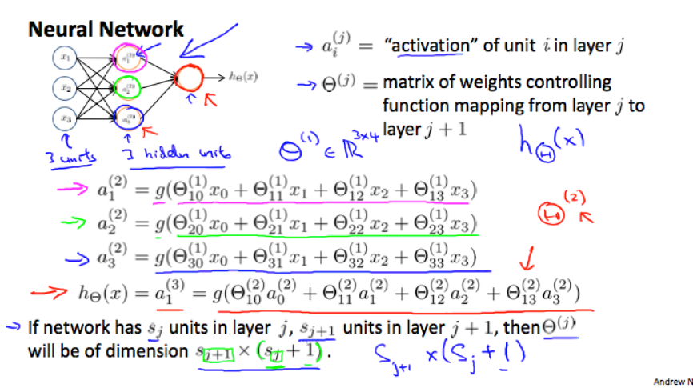
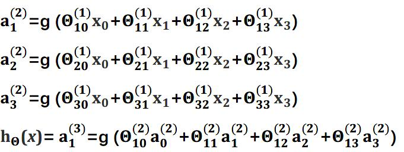
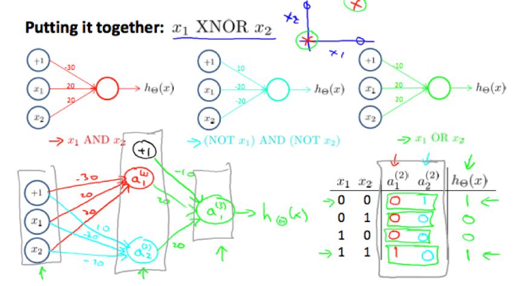
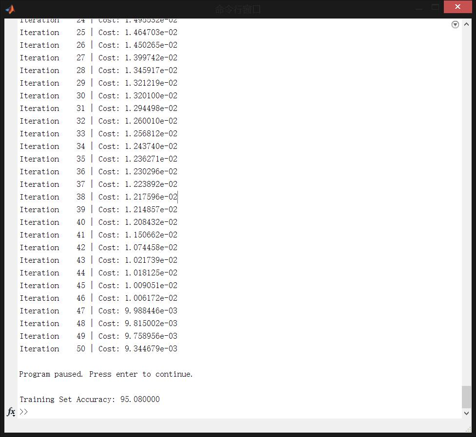
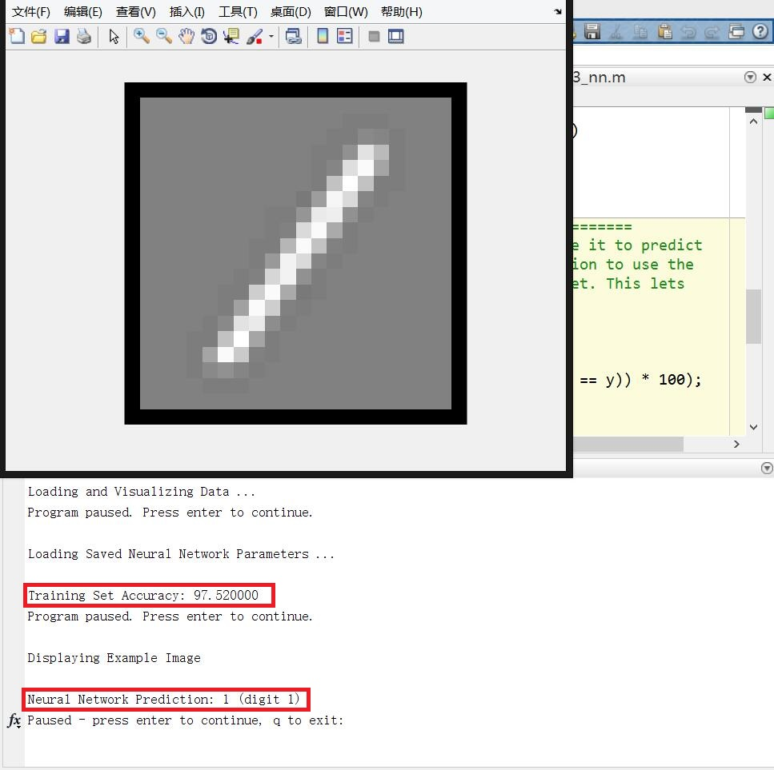

# 神经网络学习

​		现有的对神经网络仿生学的解释已经足够充分，能够在网络中找到很多解释和分析，在此不再赘述，本节将通过对神经网络前向传播算法的分析，对比多元的 Logistic 回归，可以发现，全连接神经网络其实是更为复杂的 Logistic 回归。



​		如图所示的是包含了一个隐藏层的神经网络的计算公式，不难发现，对于隐藏层而言，每一条与输入层相连的边都代表了一个权重参数，而隐藏层本身的节点代表了所有输入与对应权重相乘后再作用于激活函数后的输出结果（此处的激活函数是 sigmoid 函数）。不难发现，任意一个隐藏层节点都对所有的输入特征进行了一次 Logistic 回归，相当于一个分类器，这个分类器可能仅对摸一种特征进行提取，最后再由输出层进行一次 Logistic 回归输出最终的分类结果。



​		上图所示为图一的隐藏层以及输出层计算公式。右上角标表示层数，右下角标表示节点序号， $\Theta$ 的右下角标第一个数字表示对应层数，第二个数字表示对应上一层节点序号，右上角标表示对应层数减一（第一层为输入层没有参数）。可以看出，实际上神经网络的前向传播算法可以表示为矩阵相乘的形式。

​		 X 的每一行代表一个样本， $\Theta$ 的右下角标代表层号，$Z_i $代表第 i 的输出， $\theta_j$ 表示该层的第 j 个神经元对应的权值向量（与 $x^{(i)}$ 维度一致），k 表示该层的神经元数目。
$$
Z_1 = X\Theta_1\\
X=\left[\begin{matrix}
--x^{(0)}--\\
--x^{(1)}--\\
\vdots\\
--x^{(m)}--\\
\end{matrix}\right]
\Theta_1=\left[\begin{matrix}
|&|&\dots &|\\
\theta_0&\theta_1&\dots&\theta_k\\
|&|&\dots &|\\
\end{matrix}\right]
$$
​		往后的计算就将 Z 视为新的输入 X 以此类推即可，要点是某一层的神经元权值的维度，等于上一层的神经元个数（神经元的个数决定了这一层输出结果的维度）。


## 理解神经网络原理的实例

​		用神经网络实现异或运算：



​		图中第一层是用一个神经元实现的三种逻辑运算，分别是 x1 and x2 , (not x1) and (not x2) , 和 x1 or x2 , 第二层左图是将三个神经元组合在一起实现的求解异或问题的神经网络，右侧是真值表。由此可见，我们可以将神经网络的每一个神经元理解为对原始问题的细分提取和抽象。


## 实例1：手写数字识别——多元线性回归实现

​		程序：\machine-learning-ex3\ex3.m

​		文档：\machine-learning-ex3\ex3.pdf

​		数据可视化：


​		利用上一节提到的 Logstic 多分类回归问题，应当设计 10 个分类器，每个分类器只需将自己对应的数字标为正类，其他的标反类。

* 核心程序如下：

完全用矩阵形式的 cost function：

$$
J(\theta)=-\frac{1}{m}\sum_{i=1}^m[y^{(i)}\log(h_\theta(x))+(1-y^{(i)})\log(1-h_\theta(x^{(i)}))]+\frac{\lambda}{2m}\sum_{j=1}^{n}\theta_j^2
$$
梯度计算：
$$
\frac{\partial}{\partial\theta_j}J(\theta)=\frac{1}{m}\sum_{i=1}^m[h_\theta(x^{(i)})-y^{(i)}]x_j^{(i)}+\frac{\lambda}{m}\theta_j
$$
​		可以看到，（4）中包含了一项是 h-y 再与对应 $x_j$ 相乘再相加的项，这就可以转化为矩阵相乘的形式，如 46 行所示，X 的每一行表示一个样本， h-y 同样每一行是一个样本的预测残差，X 转置以后每一列是一个样本：
$$
\left[\begin{matrix}
|&|&\dots&|\\
x^{(1)}&x^{(2)}&\dots&x^{(m)}\\
|&|&\dots&|\\
\end{matrix}\right]
\left[\begin{matrix}
\frac{1}{m}(h_\theta(x^{(1)})-y^{(1)})\\
\frac{1}{m}(h_\theta(x^{(2)})-y^{(2)})\\
\vdots\\
\frac{1}{m}(h_\theta(x^{(m)})-y^{(m)})\\
\end{matrix}\right]=
\left[\begin{matrix}
\frac{\partial}{\partial\theta_1}J(\theta)&
\frac{\partial}{\partial\theta_2}J(\theta)&
\dots&
\frac{\partial}{\partial\theta_n}J(\theta)
\end{matrix}\right]
$$
47 行再加入正则化项。

```matlab
function [J, grad] = lrCostFunction(theta, X, y, lambda)
%LRCOSTFUNCTION Compute cost and gradient for logistic regression with 
%regularization
%   J = LRCOSTFUNCTION(theta, X, y, lambda) computes the cost of using
%   theta as the parameter for regularized logistic regression and the
%   gradient of the cost w.r.t. to the parameters. 

% Initialize some useful values
m = length(y); % number of training examples

% You need to return the following variables correctly 
J = 0;
grad = zeros(size(theta));

% ====================== YOUR CODE HERE ======================
% Instructions: Compute the cost of a particular choice of theta.
%               You should set J to the cost.
%               Compute the partial derivatives and set grad to the partial
%               derivatives of the cost w.r.t. each parameter in theta
%
% Hint: The computation of the cost function and gradients can be
%       efficiently vectorized. For example, consider the computation
%
%           sigmoid(X * theta)
%
%       Each row of the resulting matrix will contain the value of the
%       prediction for that example. You can make use of this to vectorize
%       the cost function and gradient computations. 
%
% Hint: When computing the gradient of the regularized cost function, 
%       there're many possible vectorized solutions, but one solution
%       looks like:
%           grad = (unregularized gradient for logistic regression)
%           temp = theta; 
%           temp(1) = 0;   % because we don't add anything for j = 0  
%           grad = grad + YOUR_CODE_HERE (using the temp variable)
%

h = sigmoid(X*theta);

J = mean(-y.*log(h)-(1-y).*log(1-h))+lambda/(2*m)*(sum(theta.^2)-theta(1).^2);

% for j=2:size(theta,1)
%     grad(j) = mean((h-y).*X(:,j)) + lambda/m*theta(j);
% end
grad = X'*(1/m.*(h-y));
grad(2:end) = grad(2:end) + lambda/m*theta(2:end);

% =============================================================

grad = grad(:);

end

```

​		生成分类器：

​		注意，y 是标签值范围在 1-10 （用10代表0），第 56 行 y == c 表示 y 这个列向量中只有等于 c 的元素等于 1 ，其他为 0 。例如：
$$
y=
\left[\begin{matrix}
10\\1\\2\\2\\2\\5
\end{matrix}\right],\quad\quad c=2\\
y==c\quad \Rightarrow
\left[\begin{matrix}
0\\0\\1\\1\\1\\0
\end{matrix}\right]\quad\quad\quad\quad\quad\quad
$$
对应此时分类器的目标正类。

```matlab
function [all_theta] = oneVsAll(X, y, num_labels, lambda)
%ONEVSALL trains multiple logistic regression classifiers and returns all
%the classifiers in a matrix all_theta, where the i-th row of all_theta 
%corresponds to the classifier for label i
%   [all_theta] = ONEVSALL(X, y, num_labels, lambda) trains num_labels
%   logistic regression classifiers and returns each of these classifiers
%   in a matrix all_theta, where the i-th row of all_theta corresponds 
%   to the classifier for label i

% Some useful variables
m = size(X, 1);
n = size(X, 2);

% You need to return the following variables correctly 
all_theta = zeros(num_labels, n + 1);

% Add ones to the X data matrix
X = [ones(m, 1) X];

% ====================== YOUR CODE HERE ======================
% Instructions: You should complete the following code to train num_labels
%               logistic regression classifiers with regularization
%               parameter lambda. 
%
% Hint: theta(:) will return a column vector.
%
% Hint: You can use y == c to obtain a vector of 1's and 0's that tell you
%       whether the ground truth is true/false for this class.
%
% Note: For this assignment, we recommend using fmincg to optimize the cost
%       function. It is okay to use a for-loop (for c = 1:num_labels) to
%       loop over the different classes.
%
%       fmincg works similarly to fminunc, but is more efficient when we
%       are dealing with large number of parameters.
%
% Example Code for fmincg:
%
%     % Set Initial theta
%     initial_theta = zeros(n + 1, 1);
%     
%     % Set options for fminunc
%     options = optimset('GradObj', 'on', 'MaxIter', 50);
% 
%     % Run fmincg to obtain the optimal theta
%     % This function will return theta and the cost 
%     [theta] = ...
%         fmincg (@(t)(lrCostFunction(t, X, (y == c), lambda)), ...
%                 initial_theta, options);
%

for c=1:num_labels
    initial_theta = zeros(n+1, 1);
    options = optimset('GradObj', 'on', 'MaxIter', 50);
    [theta] = ...
        fmincg(@(t)(lrCostFunction(t, X, (y == c), lambda)), ...
        initial_theta, options);
    all_theta(c,:) = theta';
end
% =========================================================================
end

```

预测函数：

```matlab
function p = predictOneVsAll(all_theta, X)
%PREDICT Predict the label for a trained one-vs-all classifier. The labels 
%are in the range 1..K, where K = size(all_theta, 1). 
%  p = PREDICTONEVSALL(all_theta, X) will return a vector of predictions
%  for each example in the matrix X. Note that X contains the examples in
%  rows. all_theta is a matrix where the i-th row is a trained logistic
%  regression theta vector for the i-th class. You should set p to a vector
%  of values from 1..K (e.g., p = [1; 3; 1; 2] predicts classes 1, 3, 1, 2
%  for 4 examples) 

m = size(X, 1);
num_labels = size(all_theta, 1);

% You need to return the following variables correctly 
p = zeros(size(X, 1), 1);

% Add ones to the X data matrix
X = [ones(m, 1) X];

% ====================== YOUR CODE HERE ======================
% Instructions: Complete the following code to make predictions using
%               your learned logistic regression parameters (one-vs-all).
%               You should set p to a vector of predictions (from 1 to
%               num_labels).
%
% Hint: This code can be done all vectorized using the max function.
%       In particular, the max function can also return the index of the 
%       max element, for more information see 'help max'. If your examples 
%       are in rows, then, you can use max(A, [], 2) to obtain the max 
%       for each row.
%       
res = sigmoid(X*all_theta');
[~, p] = max(res, [], 2);

% =========================================================================
end

```


最后运行结果：




## 实例2：手写数字识别——神经网络实现

​		程序：\machine-learning-ex3\ex3_nn.m

​		文档：\machine-learning-ex3\ex3.pdf

​		这一节将直接使用训练好的神经网络权值，实现神经网络的前向传播算法，下一节将具体讨论反向传播算法以及梯度下降。

算法核心部分：

​		需要注意的是，每当给神经网络的下一次输入之前，需要添加一列全 1 值，作为对应的偏置项（bias）。theta1 和 theta2 分别是隐藏层和输出层权值，还要注意激活函数不要忘记。（不使用激活函数时正确率仅为 60% 左右，使用后达到 97%）

```matlab
function p = predict(Theta1, Theta2, X)
%PREDICT Predict the label of an input given a trained neural network
%   p = PREDICT(Theta1, Theta2, X) outputs the predicted label of X given the
%   trained weights of a neural network (Theta1, Theta2)

% Useful values
m = size(X, 1);
num_labels = size(Theta2, 1);

% You need to return the following variables correctly 
p = zeros(size(X, 1), 1);

% ====================== YOUR CODE HERE ======================
% Instructions: Complete the following code to make predictions using
%               your learned neural network. You should set p to a 
%               vector containing labels between 1 to num_labels.
%
% Hint: The max function might come in useful. In particular, the max
%       function can also return the index of the max element, for more
%       information see 'help max'. If your examples are in rows, then, you
%       can use max(A, [], 2) to obtain the max for each row.
%

X = [ones(m, 1), X];

z1 = sigmoid(X * Theta1');

z1 = [ones(m, 1), z1];

z2 = sigmoid(z1 * Theta2');

[~, p] = max(z2, [], 2);

% =========================================================================
end
```

运行结果：



