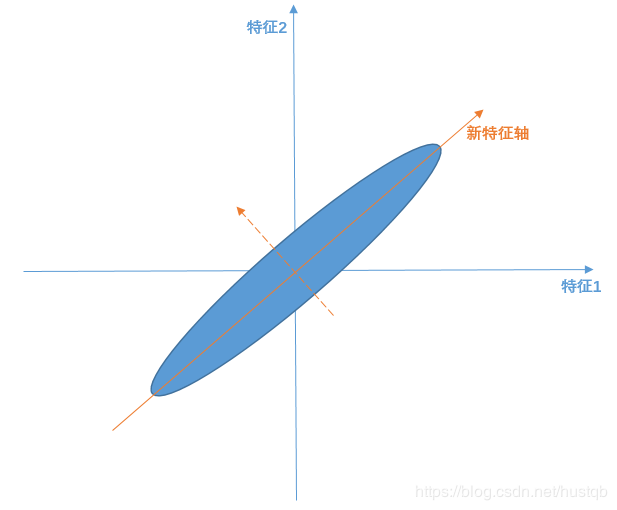

# 降维（PAC）

​		很多时候，在机器学习的任务中，常常因为样本的特征维度太高而使得神经网络结构非常复杂，可能导致网络训练的周期很长，且由于维度太大，也增加了过拟合的风险。实际上，在任务中很有可能对于样本点的特征维度，某些信息是冗余重复的。比如，在房价预测的例子中，描述房子的特征可能包括了：房间的面积 $s^2$, 房间数目 $n$，房间大小 $feet^2$ ... 其中面积和房间大小即是重复的特征。因此，使用 PCA （Principal Component Analysis）算法使得原数据的维度适当减少则可以简化学习任务。

## PCA 原理

>这部分内容摘自https://blog.csdn.net/hustqb/article/details/78394058

​		PCA全称Principal Component Analysis，即主成分分析，是一种常用的数据降维方法。它可以通过线性变换将原始数据变换为一组各维度线性无关的表示，以此来提取数据的主要线性分量。
$$
z = w^Tx
$$
​		其中，z为低维矩阵，x为高维矩阵，w为两者之间的映射关系。假如我们有二维数据（原始数据有两个特征轴——特征1和特征2）如下图所示，样本点分布为斜45°的蓝色椭圆区域。PCA算法认为斜45°为主要线性分量，与之正交的虚线是次要线性分量（应当舍去以达到降维的目的）。

重点：

1. 线性变换=>新特征轴可由原始特征轴线性变换表征
2. 线性无关=>构建的特征轴是正交的
3. 主要线性分量（或者说是主成分）=>方差加大的方向
4. PCA算法的求解就是找到主要线性分量及其表征方式的过程

​		相应的，PCA解释方差并对离群点很敏感：少量原远离中心的点对方差有很大的影响，从而也对特征向量有很大的影响。

### 线性变换

​		一个矩阵与一个列向量A相乘，等到一个新的列向量B，则称该矩阵为列向量A到列向量B的线性变换。

​		我们希望投影后投影值尽可能分散，而这种分散程度，可以用数学上的方差来表述。
$$
Var(a)=\frac{1}{m}\sum_{i=1}^{m}(a_i-u)^2
$$
​		即寻找一个一维基，使得所有数据变换为这个基上的坐标表示后，方差值最大，方差越大，说明数据越分散。通常认为，数据的某个特征维度上数据越分散，该特征越重要。

​		对于更高维度，还有一个问题需要解决，考虑三维降到二维问题。与之前相同，首先我们希望找到一个方向使得投影后方差最大，这样就完成了第一个方向的选择，继而我们选择第二个投影方向。如果我们还是单纯只选择方差最大的方向，很明显，这个方向与第一个方向应该是“几乎重合在一起”，显然这样的维度是没有用的，因此，应该有其他约束条件——就是正交。从直观上说，让两个字段尽可能表示更多的原始信息，我们是不希望它们之间存在（线性）相关性的，因为相关性意味着两个字段不是完全独立，必然存在重复表示的信息。字段在本文中指，降维后的样本的特征轴。

​		数学上可以用两个字段的协方差表示其相关性：
$$
Cov(a,b)=\frac{1}{m}\sum_{i=1}^m(a_i-\mu_a)(b_i-\mu_b)
$$
​		当协方差为0时，表示两个字段线性不相关。

​		总结一下，PCA的优化目标是：
​		**将一组N维向量降为K维（K大于0，小于N），其目标是选择K个单位正交基，使得原始数据变换到这组基上后，各字段两两间协方差为0，而字段的方差则尽可能大。**

​		所以现在的重点是**方差和协方差**。

### 协方差

​		在统计学上，协方差用来刻画两个随机变量之间的相关性，反映的是变量之间的二阶统计特性。考虑两个随机变量 $X_i$ 和 $X_j$，它们的协方差定义为
$$
cov(X_i,X_j)=E[(X_i-E(X_i))(X_j-E(X_j))]
$$
​		注意，对于两个独立随机变量而言，它们的协方差肯定为 0 ， 但是对于两个协方差为 0 的随机变量却不一定独立，只能说它们不相关。（协方差判定的是两个随机变量的线性相关性）。

​		协方差矩阵：

​		假设有 m 个变量，特征维度为 2，$a_1$ 表示变量 1 的 a 特征，那么构成的数据集矩阵为： 
$$
X=
\left(\begin{matrix}
a_1 & a_2 & \dots & a_m \\
b_1 & b_2 & \dots & b_m
\end{matrix}\right)
$$
​		再假设这两个维度上样本值的均值为 0 ，对于两个特征维度均值为 0 的 m 个向量组成的向量组：
$$
\frac{1}{m}XX^T=
\left(\begin{matrix}
\frac{1}{m}\sum_{i=1}^ma_i^2 & \frac{1}{m}\sum_{i=1}^ma_ib_i\\
\frac{1}{m}\sum_{i=1}^ma_ib_i & \frac{1}{m}\sum_{i=1}^mb_i^2
\end{matrix}\right)
$$
​		可以发现对角线上的元素是两个字段的方差，其他元素是两个字段的协方差，两者都被统一到了一个矩阵——协方差矩阵中。

​		**回顾一下前面所说的PCA算法的目标：方差max，协方差min！！**

​		要达到PCA降维目的，等价于将协方差矩阵对角化：即除对角线外的其他元素化为0，并且在对角线上将元素按大小从上到下排列，这样我们就达到了优化目的。

​		设原始数据矩阵X对应的协方差矩阵为C，而P是一组基按行组成的矩阵，设Y=PX，则Y为X对P做基变换后的数据。设Y的协方差矩阵为D，我们推导一下D与C的关系：
$$
D=\frac{1}{m}YY^T=\frac{1}{m}(PX)(PX)^T=\frac{1}{m}PXX^TP^T=P(\frac{1}{m}XX^T)P^T=PCP^T
$$
​		即想让原始数据集 X =>pca 成数据集Y，使得Y的协方差矩阵是个对角矩阵。

有上述推导可得，若有矩阵P能使X的协方差矩阵对角化，则P就是我们要找的PCA变换。

​		优化目标变成了寻找一个矩阵 P ， 满足 $PCP^T$ 是一个对角阵，并且对角线元素按照从大到小排列，那么 P 的前 K 行就是要寻找的基，用 P 的前 K 行组成的矩阵乘 X 就使得 X 从 N 维降到了 K 维并满足上述的优化条件。

### 矩阵对角化

​		首先，原始数据 X 的协方差矩阵是一个实对称阵，它有着特殊的数学性质：

1. 实对称阵不同的特征值对应的特征向量必然正交。
2. 设特征值 $\lambda$ 重数为 r ，则必然存在 r 个线性无关的特征向量对应于 $\lambda$ ，因此可以将这 r 个特征向量单位正交化。

​		一个 n 行 n 列的实对称阵一定是可以找到 n 个单位正交的特征向量的，设它们为 $e_1,e_2,\dots,e_n$ ，我们将其按列排成矩阵：
$$
E = (e_1,e_2,\dots,e_n)
$$
​		则有：
$$
C=E\Lambda E^T\\
\Lambda=
\left(\begin{matrix}
\lambda_1\\
& \lambda_2\\
&& \ddots\\
&&& \lambda_n
\end{matrix}\right)
$$
​		并且 E 是单位正交阵， 即 $E^{-1}=E^T$ ，所以：
$$
E^TCE=\Lambda
$$
​		因此， 对照（7）式 $D=\Lambda,\quad P=E^T$ 。

​		P是协方差矩阵的特征向量单位化后按行排列出的矩阵，其中每一行都是C的一个特征向量。如果设P按照中特征值的从大到小，将特征向量从上到下排列，则用P的前K行组成的矩阵乘以原始数据矩阵X，就得到了我们需要的降维后的数据矩阵Y。

